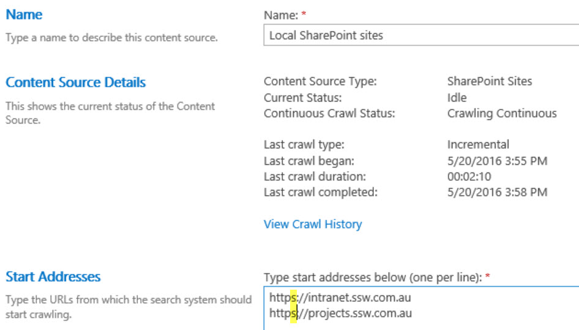

Using default zone URL in search content source, it will be automatically convert to the relative URL on the search result.e.g. if a user access  search center via http://projects.ssw.com.au/search, the result will be like http://projects.ssw.com.au/search/xxx. While another user access search center via http<mark>s</mark>://projects.ssw.com.au/search, the result will be http<mark>s</mark>://projects.ssw.com.au/search/xxx.

::: bad
Bad example: use https://projects.ssw.com.au  
:::

::: good
Good example: use http://project.ssw.com.au  
:::

<!--endintro-->
