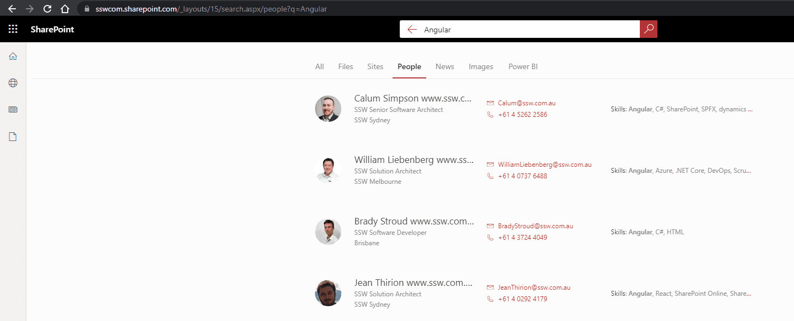
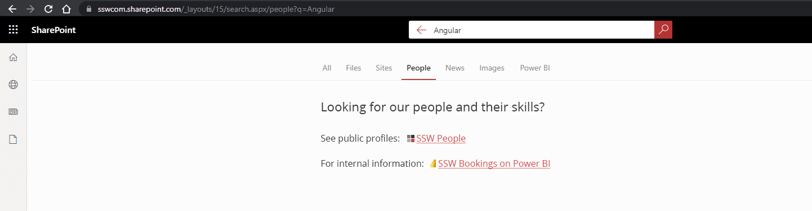
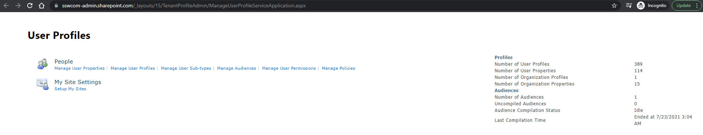
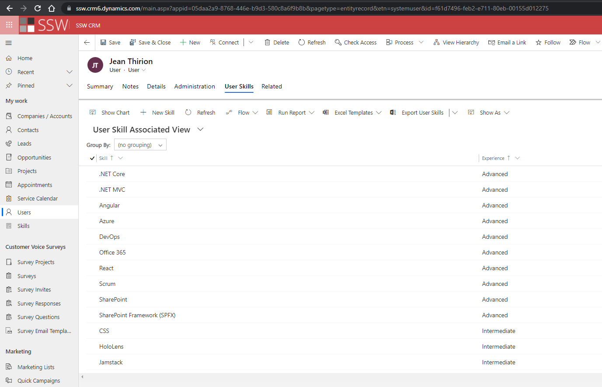
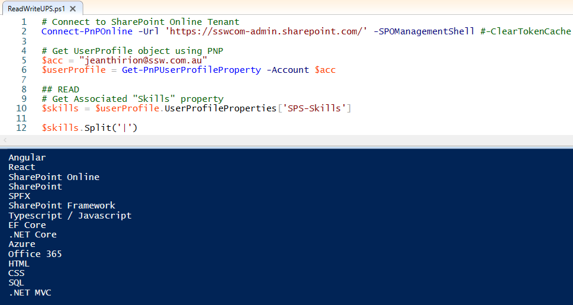
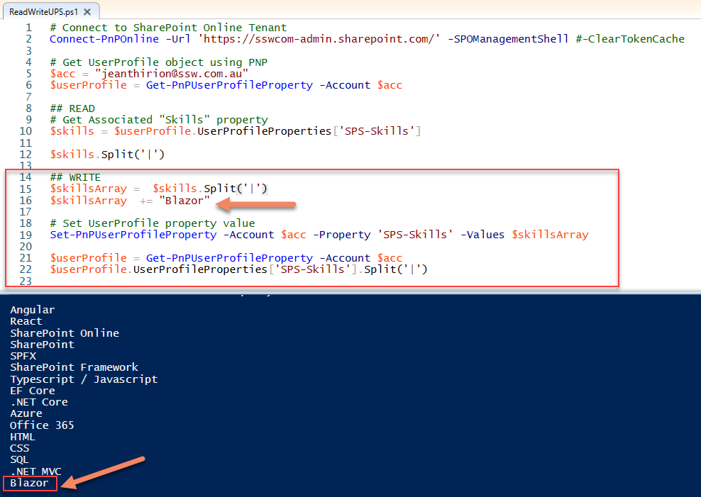
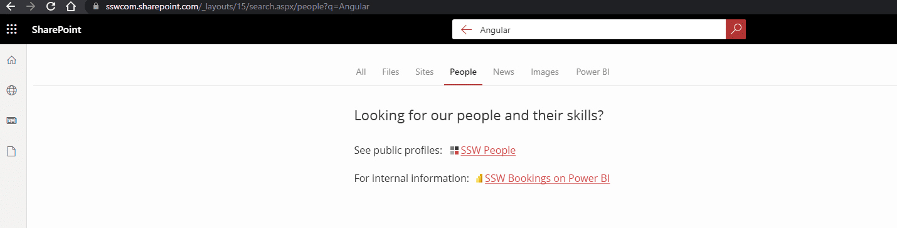
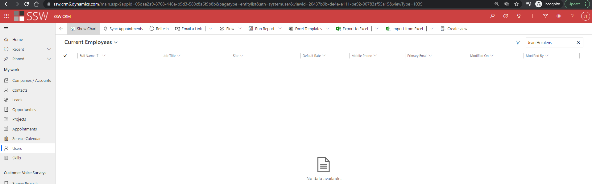

`youtube: https://www.youtube.com/watch?v=fhnatho4nSg`

AD has all your users e.g. Bob, Mary, Jane...

SharePoint also has all your users, plus you can extend this information using the UserProfile Service – https://docs.microsoft.com/en-us/sharepoint/manage-user-profiles

The beauty of this is that if everyone has updated their skills, it is wonderfully searchable.

<!--endintro-->

SharePoint has an Admin UI to manage User Profiles

[Delve](https://support.microsoft.com/en-us/office/what-is-delve-1315665a-c6af-4409-a28d-49f8916878ca) is a cool product with a nice UI that is essentially a portal onto the User Profiles.

Where it all falls down...

What if your people’s skills are stored in another system such as Dynamics 365 CRM or Salesforce ?

You can use PowerShell and SharePoint PNP libraries to programmatically interact with the SharePoint UserProfile service. This process allows you to sync skills across systems with a custom solution:

OpenSearch is another solution, using the OpenSearch protocol you can [add external data sources to your SharePoint search results](https://docs.microsoft.com/en-us/sharepoint/search/understanding-result-sources-for-search)

#### Suggestions to Microsoft:

**#1 Help me better sync my Dynamics 365 CRM data with the SharePoint user profile service**

This should be a simple SharePoint connector so this piece of PowerShell glue is not required 👌\
E.g. CRM user skills to User Profile properties

**#2 Help me make Dynamics 365 CRM data searchable from SharePoint search**

If not using a connector, we should be able to easily index and search through Dynamics 365 CRM data.
This is essentially just calling a different API.

**#3 Help me customise SharePoint search results**

If you don’t want either of those options (i.e. you users’ skills are stored somewhere else), we should be able to change the search results UI.\
E.g. Search for people here: https://ssw.com.au/people

**[\#4 Help me search for user entities in Dynamics 365 CRM](https://experience.dynamics.com/ideas/idea/?ideaid=b5daa141-90f5-eb11-ba5e-0003ff457d0a)**

There should be a global user search that goes across all entities in Dynamics 365 CRM.

