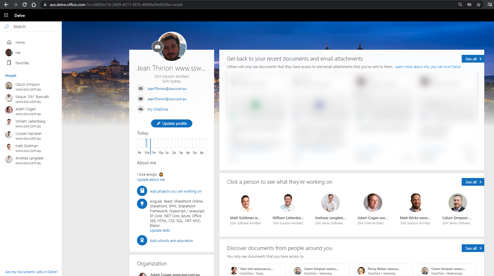

AD has all your users e.g. Bob, Mary, Jane...

SharePoint also has all your users, plus you can extend this information using the UserProfile Service – https://docs.microsoft.com/en-us/sharepoint/manage-user-profiles

The beauty of this is that if everyone has updated their skills, it is wonderfully searchable.

<!--endintro-->

SharePoint has an Admin UI to manage User Profiles

[Delve](https://aus.delve.office.com) is a cool product with a nice UI that is essentially a portal onto the User Profiles.

Where it all falls down...

What if your people’s skills are stored in another system such as Dynamics 365 CRM or Salesforce ?

You can use Powershell and SharePoint PNP libraries to read and write from and to the UserProfile service:

#### Suggestion to Microsoft:

**[\#1 Data Sync](https://sharepoint.uservoice.com/forums/329220-sharepoint-dev-platform/suggestions/43922373-help-me-better-sync-my-dynamics-365-crm-data-with)** – this should be a simple SharePoint connector so this piece of PowerShell glue is not required 👌
e.g. CRM user skills to User Profile properties

**[\#2 SharePoint Search](https://sharepoint.uservoice.com/forums/330321-sharepoint-search/suggestions/43922382-help-me-make-dynamics-365-crm-data-searchable-from)** – if not using a connector, we should be able to easily index and search through Dynamics 365 CRM data
This is essentially just calling a different API

**[\#3 SharePoint Search UX](https://sharepoint.uservoice.com/forums/330321-sharepoint-search/suggestions/43922385-help-me-customise-sharepoint-search-results)** – if you don’t want either of those options (i.e. you users’ skills are stored somewhere else), we should be able to change the search results UI
e.g. “Search for people here: https://ssw.com.au/people”

**\#4 Dynamics Search** – there should be a global user search that goes across all entities in Dynamics 365 CRM

