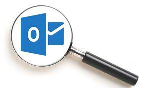
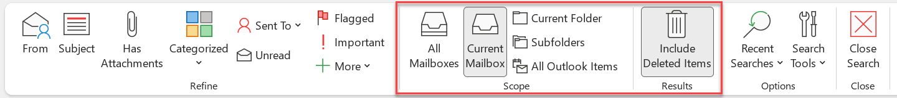
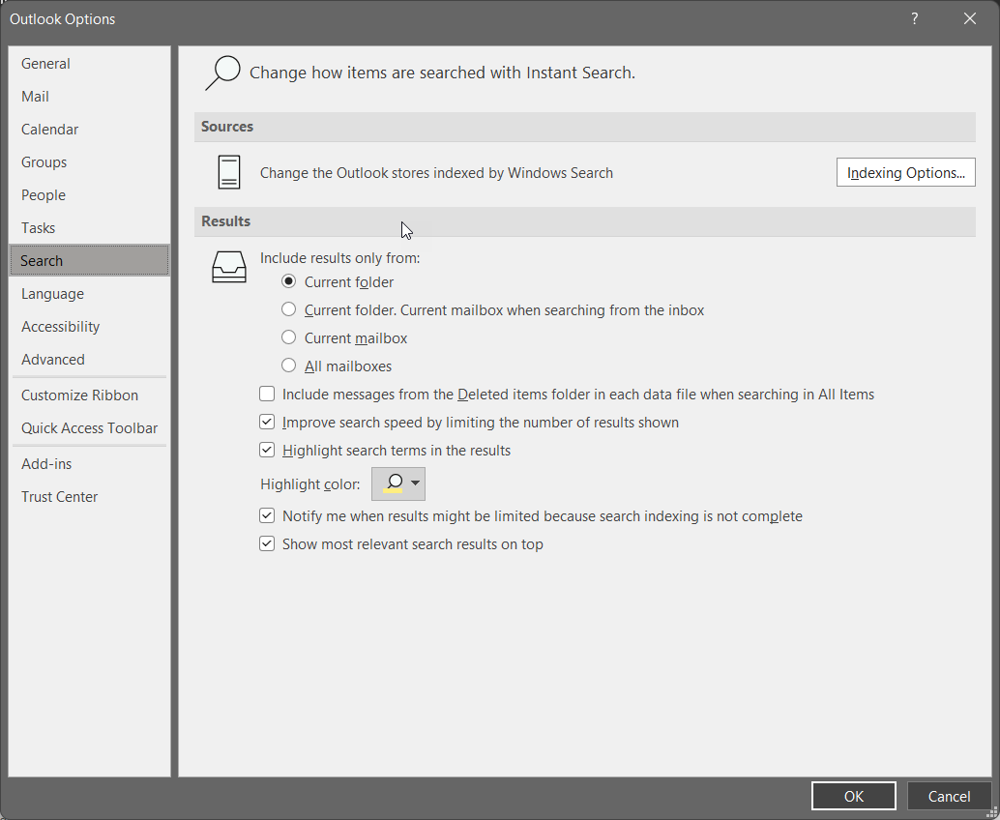
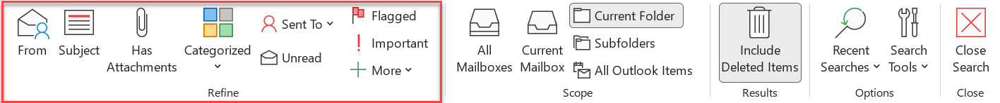

Some people are really good at using Outlook search to find the emails they need, while others have a hard time. Searching for emails can be a real struggle, sometimes you want to find emails from months ago but you aren't sure exactly what to search for.

Being able to find an email quickly in Outlook is an important skill. Here are some tips and tricks about how to find that email buried in your inbox...

`youtube: https://www.youtube.com/embed/AM7Y3f3h2Lw`

<!--endintro-->

::: greybox
**Note:** These tips will also help you in your Google/Bing searches too.  
:::

### Scenario

Let's take an example scenario and see what tips we can use to search. Last month, you got an email in your inbox from your manager Bob about making changes to how you see data in his Northwind website.

### Tip 1: Give the person you are talking to the focus

If you get 10 calls a day, you should be using this tip 10 times a day. When you get a call from Bob, before he has finished saying "how are you" you should have already typed in the search box and be looking at his most recent emails.

To get Bob's most recent emails the best thing to do, is to limit Outlook to only your inbox folder and only emails from Bob by:

* Change the folder to "Current Folder"
* Search for: &nbsp;&nbsp; **from:Bob**

**Note #1:** You can change the folder scoping to fit your specific needs
  

**Note #2:** You can change the default to always be "Current Folder"

  

### Tip 2: Focus on the person (i.e. to: from: cc: bcc:)

There are many different ways to focus on people. If know that the email was sent to Adam, from Bob, Luke was CCed and Chris was BCCed then:

* Search for: &nbsp;&nbsp; **to:Adam from:Bob cc:Luke bcc:Chris**

### Tip 3: Focus on the subject (i.e. subject:)

If you have a good idea of what the email subject contains, then the "subject:" scope can help a lot. For example, if you know that the email had Northwind and Bob in the subject then:

* Search for: &nbsp;&nbsp; **"Subject: Northwind Bob"**

### Tip 4: Use negatives (i.e. –)

Negatives are a great way to remove results you know definitely won't be relevant. For example, if you know Luke and Adam frequently work with Bob but weren't involved in that email then:

* Search for: &nbsp;&nbsp; **\-Luke -Adam**

Note: Start with a broad search, and then, when you start seeing irrelevant results about invoicing, add -invoice to your search

### Tip 5: Use quotation marks (i.e. “”)

You can search for a direct match in an email using quotation marks. For example, if you know that "days outstanding" was written in the email then:

* Search for: &nbsp;&nbsp; **"days outstanding"**

Note: Particularly useful when using common words but you know they were written in an exact phrase. E.g. “on top of this”

### Tip 6: Combine 2 searches into 1 (i.e. OR)

Sometimes you might know a specific thing was referred to, but aren't sure what terminology was used. For example, let's say you know the email mentioned either "web app" or "website". In that case:

* Search for: &nbsp;&nbsp; **"web app" OR website**

Note: Must be upper case... lowercase “or” won’t work

### Tip 7: Find a file (i.e. hasattachments:yes)

Emails can be filtered to only include ones with attachments. If you know the email has an attachment then:

* Search for: &nbsp;&nbsp; **hasattachments:yes**

### Tip 8: Find a file’s content (i.e. attachment:)

File contents can also be searched. If you know that there was an attachment that contained the text "20/07/2021" then:

* Search for: &nbsp;&nbsp; **attachment:"20/07/2021"**

Note: You must enter dates in USA format #ouch

### Tip 9: Focus on the date received (i.e. received=<>)

You can filter on a specific time period or date. For example, If you know that the email was received after 07/20/2019 then:

* Search for: &nbsp;&nbsp; **received>"07/20/2019"**

Note #1: You must enter dates in USA format #ouch

More Info: 
Outlook has a heap of other properties that you can filter on.

**Learn more:** [How to search in Outlook](https://support.microsoft.com/en-us/office/how-to-search-in-outlook-d824d1e9-a255-4c8a-8553-276fb895a8da).