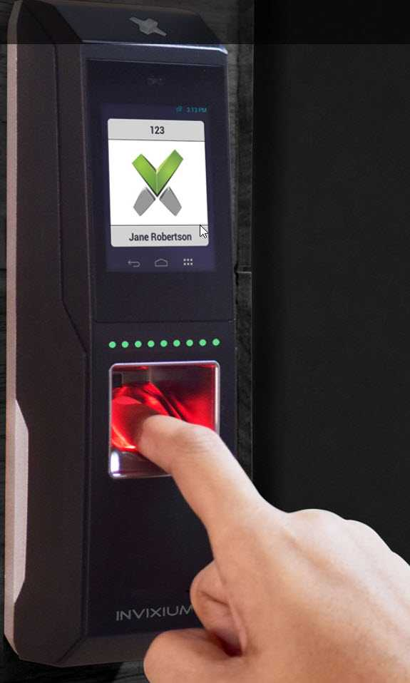
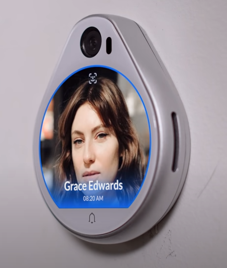

Do you know who is entering your premises, when, and how? Keys or key-cards can be expensive, they can be lost, and people can loan them to one another without any restriction.

<!--endintro-->

There are all kinds of ways to monitor access to your building and more secure areas. While fingerprint scanners are a good way of monitoring and restricting access, they are difficult to use in practice. Not everyone has great fingerprints, and access can be sketchy and frustrating when it doesn't work. 

The best way to do control your buildings' access is to use an automated NFC (an acronym for Near Field Communication) Access System like Unifi by Ubiquiti.

* You only need your phone, so there are no keys to lose or replace
* It is easy to add or remove access for staff & visitors
* You can see who is coming and going and when
* It can connect to your security cameras for additional security

To see more about how the system works, watch this cool 4min video from Ubiquiti UniFi Access: 

`youtube: https://www.youtube.com/embed/wh_nPEOtLzc`

::: bad

:::

::: good

:::
