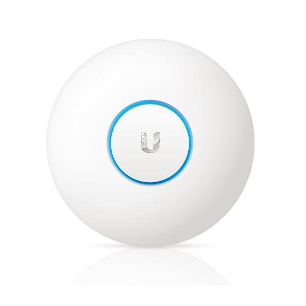
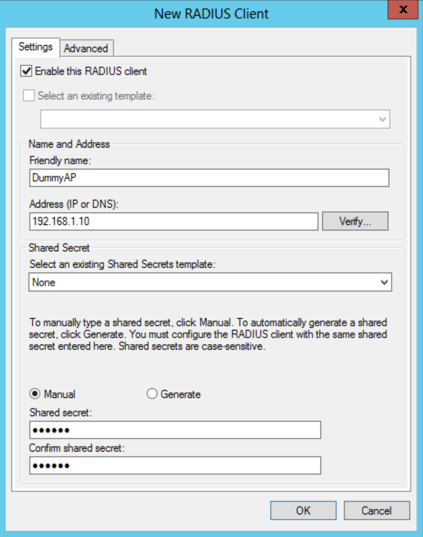
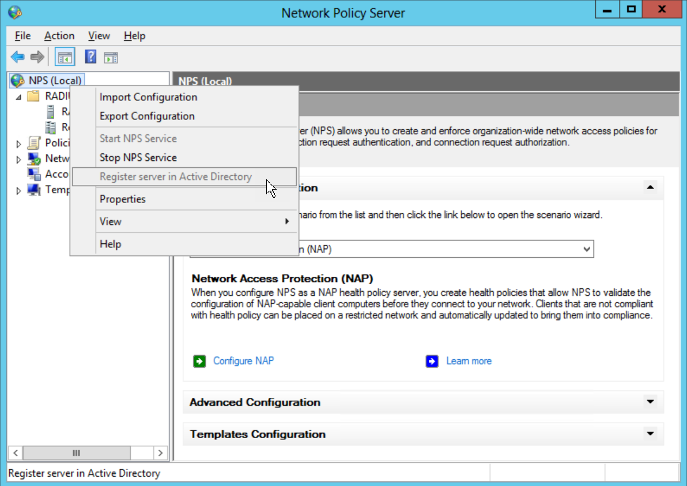
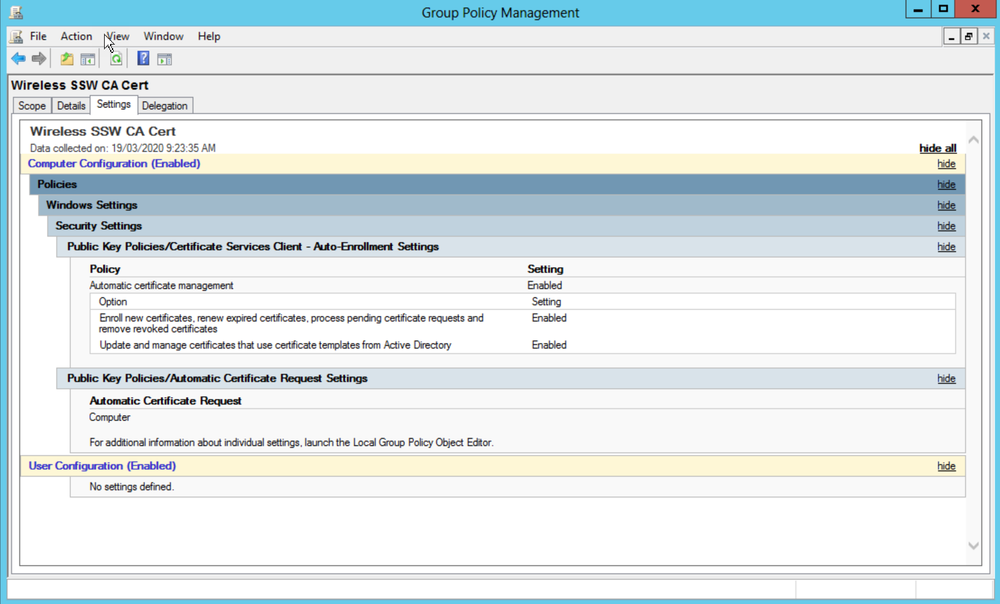
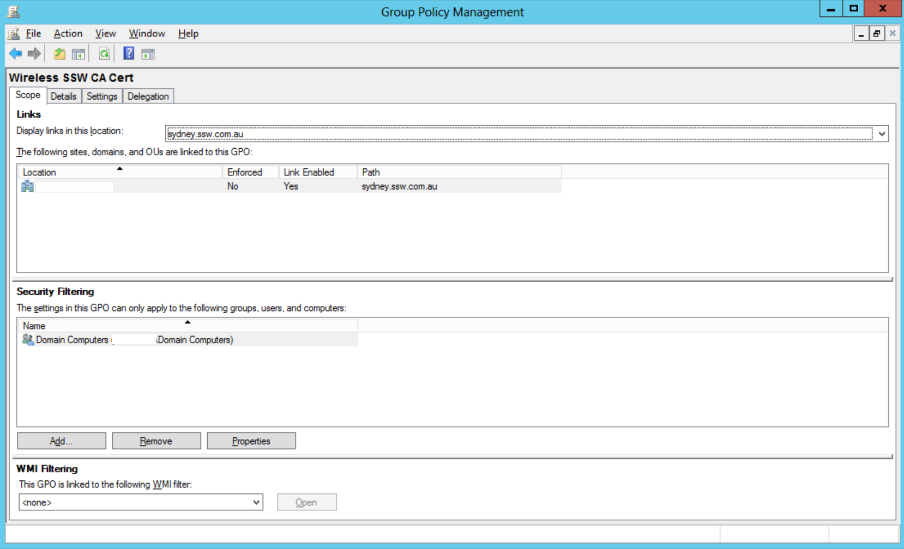
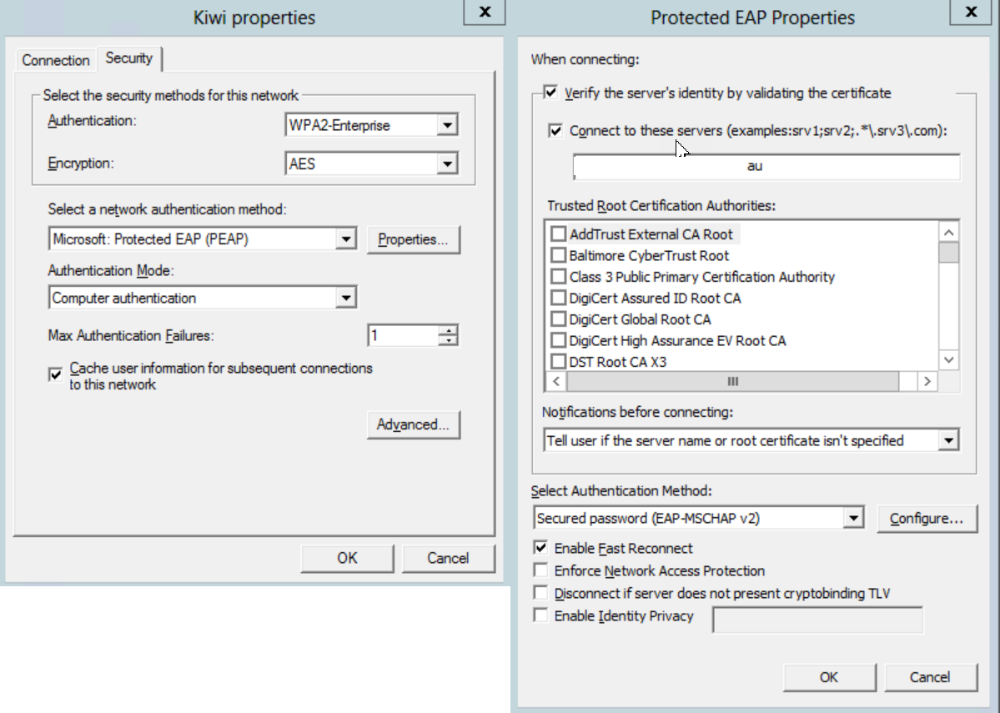
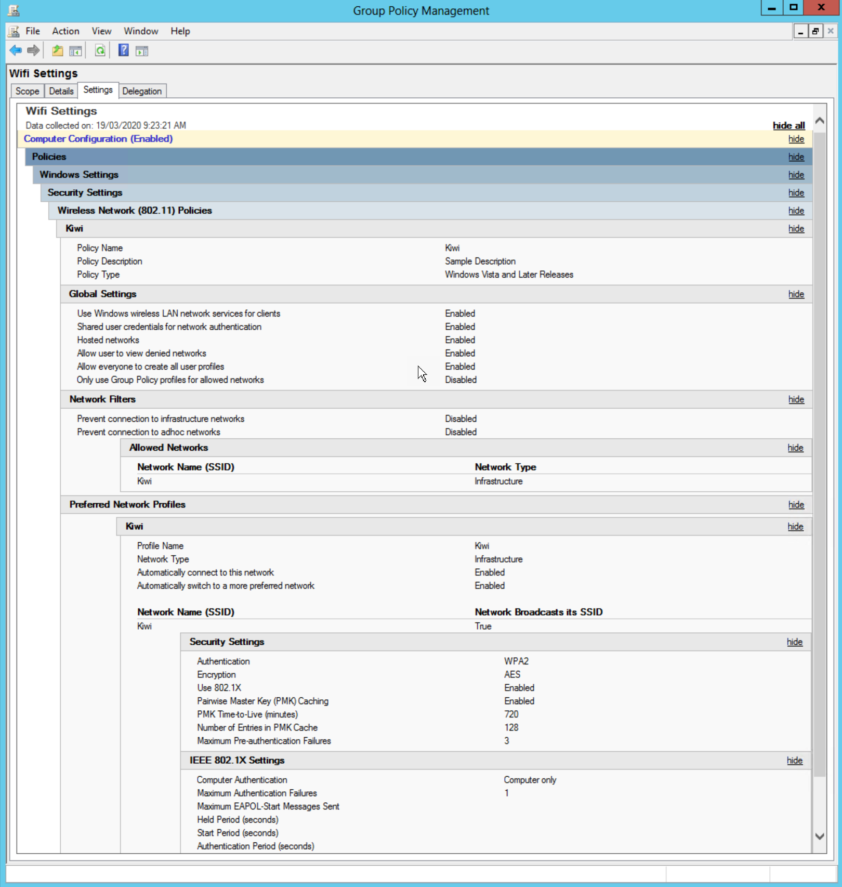

Wireless networks are everywhere now. You can't drive down the street without finding a network which is insecure. However, in an office environment, there is a lot more to lose than a bit of bandwidth. It is vital that wireless is kept secure.

<!--endintro-->

::: greybox
WEP, No SSID broadcast, allowed MAC addresses are all OK but these are more home security.
:::

::: bad
Figure: Bad example - the above settings are not suitable for a company's wireless access point

:::

For the office, you need something a bit more robust and not requiring much management overhead.

::: greybox
It is recommended to use Radius authentication to integrate with your Active Directory.

:::

::: good
Figure: Good example - configure your wireless access point to authenticate against AD\
:::

This article explains how to setup your wireless AP to use WPA2-enterprise. WPA2-Enterprise verifies network users (AD a/c's) through a server (Domain Controller).

The recommended method of authentication is PEAP (Protected Extensible Authentication Protocol), which authenticates wireless LAN clients using only server-side digital certificates (In our case we used an AD CA) by creating an encrypted SSL/TLS tunnel between the client and the authentication server. The tunnel then protects the subsequent user authentication exchange.

#### Requirements:

* 802.1X-capable 802.11 wireless access points (APs)
* Active Directory with group policy
* Network Policy Server (NPS) servers
* Active Directory Certificate Services based PKI for Server certificates for NPS computer/s and your wireless PC's

#### Assumptions:

This document assumes you have some knowledge of how to configure your wireless access points and install server roles. It also assumes that you have already configured an Enterprise Certificate Authority on your Active Directory Domain.

1. **Configure your wireless access points**
     In SSW we use Unifi APs. I have configured these access points to:
     
2. **Install NPS on your server**
   On Windows 2008 or 2008 R2 open up the server manager and:

   1. Add the "Network Policy and Access Services" Role
      Under role services add:

   * Network Policy Server
   * Routing and Remote Access Services
3. **Configure Radius Clients on NPS**
   Open up the NPS Console. Right click on "Radius Clients", and then click on "New".
   Fill out the fields for Friendly Name (enter the name of the wireless access point), Address (IP address) and then add the shared secret (Keep this safe for example we use Keepass as a password repository) you configure on your access point.

  

4. **Configure 802.1x on the NPS server**
      In the NAP servers Server Manager, open "Roles", then "Network Policy and Access Services" then click on NPS (Local).
      In the right-hand pane under standard configuration choose "Radius Server for 802.1x Wireless or Wired Connections", and then click on "Configure 802.1X" to start a wizard-based configuration.

   1. Select the top radio button “Secure Wireless Connections" click next
   2. On the Specify 802.1X Switches Page check the AP's you have configured under Radius Clients are in that list then click next
   3. Now the authentication method. From the Drop Down lists select Protected EAP (PEAP)
      **NOTE:** This method requires a Computer Certificate and the Radius Server and either a computer or user certificate on the client machine
   4. Select the groups (eg. Domain\WirelessAccess) you would like to give wireless access to. You can do this by user or computer or both
   5. If you need to configure VLan's in the next step, wasn't required in my case I just used the defaults
   6. You then need to register the server with Active Directory. So right click on NPS (local) and select Register Server in Active Directory

\
    You should now have a Connection Request Policy and a Network Policy. Remove the MS-CHAP v1 authentication method from the network policy (under the constraint's tab).

5. **Configure Certificate Auto enrolment**
   First open Group Policy Management.

   1. Create a new GPO policy and name it "Cert_Enrollment_Wireless" or whatever name you deem suitable and link it to the root of the domain or a specific OU depending on your needs and OU structure
   2. Under the security filtering scope for what the policy gets applied to remove "Authenticated Users" and add your AD created. This ensures that the policy, once configured, is applied only to members of those groups.
   3. Edit the settings of the group policy and go to:

      1. Computer Configuration\Policies\Windows Settings\Security Settings\Public Key Policies
         In the details pane, you need to right-click the Certificate Services Client – Auto-enrolment and then select properties.
         In the Properties, dialog box select enabled from the drop down box and then place a tick in all the remaining tick boxes. This makes sure that the computer auto-enrolls for a certificate from AD CA.
      2. Now navigate to Computer Configuration\Policies\Windows Settings\Security Settings\Public Key Policies\Automatic Certificate Request Settings
         Right-click in the details pane and select New | Automatic Certificate Request.
         This will open up a wizard and you can select a Computer Certificate.

  

6. **Creating a Windows Wireless 802.1x GPO Policy**

   1. Now go to Computer Configuration\Policies\Windows Settings\Security Settings\Wireless Network (IEEE 802.11) Policies
      Right click and Create a new policy for Windows Vista and later (if you only have XP machines, do only an XP one). If you have Vista or later you must do a Vista policy or else Vista will try to use the XP policy (not recommended).
   2. Enter a Policy Name (e.g. Beijing_Wifi_Settings) and description and link to the root of the domain.

\
    3. Click "Add" and then enter a Profile Name and then Add the SSID name from the Wireless Access Point/s. Make sure the tick box "Connect Automatically when this network is in range" is ticked...
    4. Click on the Security Tab
        Make sure Authentication is "WPA2-Enterprise" and Encryption is "AES).
        Under "Select a network authentication method, choose "Microsoft: Protected EAP (PEAP).
        Under Authentication Mode, you need to choose whether you want to authenticate computers and/or users with your digital certs. Then select "Computer Authentication".
    5. Click on the "Properties" button
        Tick "Validate server certificate" and then tick "Connect to these servers". Enter the FQDN of the NPS.
        Then under Trusted Root Certification Authority, tick your Root CA certificate. Then click OK.

\
    6. Click OK twice.
        **Optional:** Under Network Permission tab you can use the tick boxes to restrict clients to infrastructure networks or only GPO profiled allowed networks if you desire.
    7. Click OK and you have completed your Windows Wireless Policy

