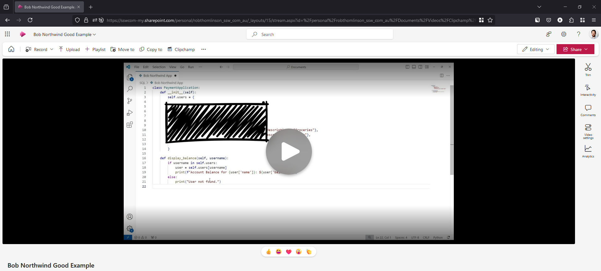
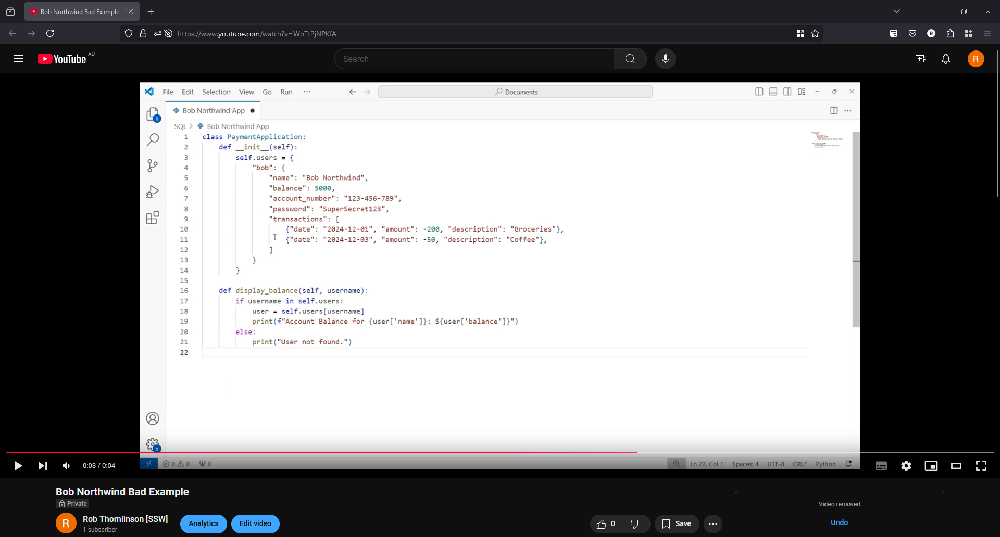

Sharing sprint summaries is an essential part of agile development, but ensuring they are shared securely is equally important—especially when the summaries contain sensitive information. Without proper precautions, sensitive data can inadvertently become accessible to unauthorized parties, creating significant risks.

<!--endintro-->

### Best Practices for Sharing Sprint Summaries

When creating sprint summaries that include sensitive content, such as internal metrics, proprietary workflows, or discussions about client projects, follow these steps to keep them secure:

#### 1. Choose a Secure Hosting Platform

- **Option 1 (Recommended)**: **Microsoft Stream** (for videos) and **SharePoint** (for files)
  - When recording videos via Teams, they are automatically uploaded to Microsoft Stream, which ensures the videos remain private within your organization. SharePoint provides similar controls for document sharing and integrates seamlessly with other Microsoft 365 tools.
  - This is the ideal choice for organizations already using Microsoft Teams and Microsoft 365.

- **Option 2**: **YouTube Private**
  - For teams not using Microsoft Teams, YouTube's "Private" option can be used to share videos securely. Be cautious, as this approach requires explicit control over sharing permissions to prevent accidental exposure.
  - Use this option only when Microsoft Stream is not available.

#### 2. Restrict Access to Authorized Individuals

Ensure that only the relevant team members or stakeholders can view the sprint summaries:
- Set file or folder permissions based on specific roles or groups.
- Periodically review permissions to remove access for users who no longer need it.

#### 3. Use Obfuscation Techniques for Additional Security

For extra protection, particularly when the information might be shared more broadly:
- **Redact information**: Replace or black out sensitive details in documents or screenshots.
- **Generalize context**: Use placeholders (e.g., "Client A" or "Project B") instead of real names and specifics.

Obfuscation reduces the risk of accidental exposure while still allowing for effective communication.

#### 4. Securely Share Links

If you need to Securely Share Links of your recording, please see these rule:
- [Do you know how to securely share your passwords?](https://www.ssw.com.au/rules/secure-password-share)
- [Do you know the best way to share a password externally?](https://www.ssw.com.au/rules/password-sharing-practices)

#### 5. Regularly Review Privacy Policies of Hosting Services

Platforms like SharePoint and Stream adhere to strict security standards, but regular audits of your privacy settings and hosting policies help ensure continuous compliance with organizational or legal requirements.

---

::: greybox
**Scenario:**
You need to share a sprint summary video with your team, and it contains client-sensitive information.

**Steps:**
1. Upload the video to Microsoft Stream or SharePoint.
2. Set permissions to allow viewing only for specific team members.
3. Use the platform's secure sharing link feature, ensuring it’s time-limited.
:::

::: good

:::

::: bad

:::

By adopting these practices, you can create and share sprint summaries confidently, ensuring sensitive information remains secure.
