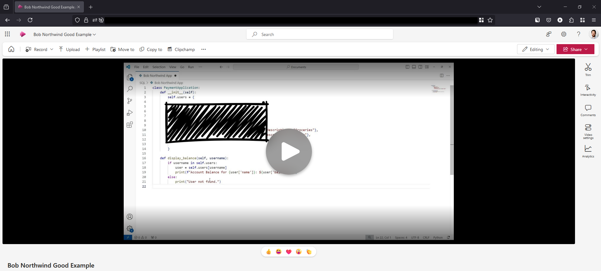

Sharing sensitive information is an essential part of any business, however sharing information securely is equally important, especially when files, videos or images can contain sensitive information. Without proper precautions, sensitive data can inadvertently become accessible to unauthorised parties, creating significant risks.

<!--endintro-->

## Best practices for sharing sensitive information

When sharing files which may include sensitive content, such as discussions about clients or current security issues for a product, follow these steps to keep them secure:

### 1. Choose a secure hosting platform

* **Option 1** - **SharePoint** for files / **Microsoft Stream** for videos (Recommended)
  When recording videos via Teams, you can automatically uploaded the recordings to Microsoft Stream, this ensures that the videos remain private within your organization.
  SharePoint provides similar controls for document sharing and integrates seamlessly with other Microsoft 365 tools like Microsoft Stream.

* **Option 2** - **Google Drive**
  When using the Google Suite users can upload files to Google Drive for the organisation and restrict access similarly to the Microsoft 365 suite.

* **Option 3** - **YouTube videos set to private visibility**
  For teams not using Microsoft 365 products, YouTube's "Private" option can be used to share videos securely. Be cautious, as this approach can accidentally expose videos publicly if you are not careful.

### 2. Restrict access to authorized individuals

Ensure that only the relevant team members or clients can view sensitive information:

* Set file or folder permissions based on specific roles or groups
* Periodically review permissions to remove access for users who no longer need it

### 3. Use data security techniques

For extra protection, particularly when the information might be shared more broadly:

* **Redact information** - Replace or black out sensitive details in documents or screenshots
* **Generalise context** - Use placeholders (e.g., "Client A" or "Project B") instead of real names and specifics

### 4. Securely share links

If you need to securely share links, please see these rules:

* [Do you know how to securely share your passwords?](/secure-password-share)
* [Do you know the best way to share a password externally?](/password-sharing-practices)

### 5. Regularly review privacy policies on hosting services

Platforms like SharePoint and Stream adhere to strict security standards, but regular audits of your privacy settings and hosting policies help ensure continuous compliance with organizational or legal requirements.

## Example

::: greybox
**Scenario:**
You need to share a Sprint summary video with your team, and it contains client-sensitive information.

**Steps:**

1. Upload the video to Microsoft Stream or SharePoint
2. Set permissions to allow viewing only for specific team members
3. Use the platform's secure sharing link feature, ensuring it's time-limited
:::

:::bad

:::

:::good

:::
