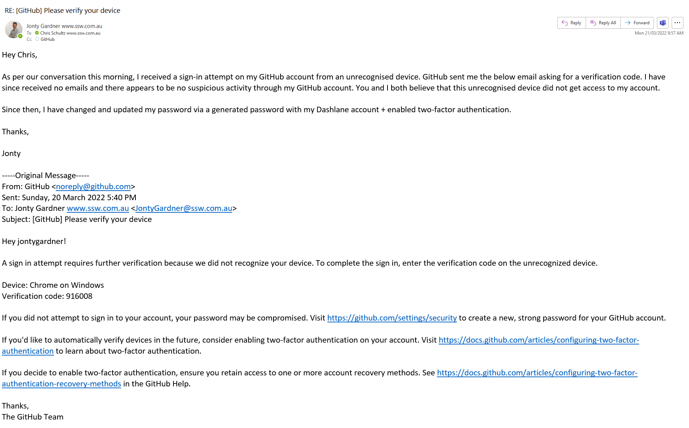

Anyone with a compromised password or account IMMEDIATELY contacts SysAdmins for help. Whether it is a personal or an SSW account.

A personal (e.g. Gmail) breach should be informed and resolved by a System Administrator immediately. Expect the same level of service on a personal breach as you would on a corporate breach.

Why? If your Gmail has been hacked this can have implications for the company.

Once you have informed your Systems Administrator of a potential breach send an "As Per My Conversation" email - https://ssw.com.au/rules/as-per-our-conversation-emails

::: good

:::
