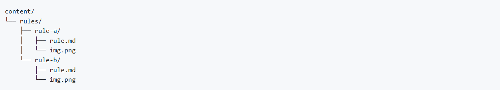
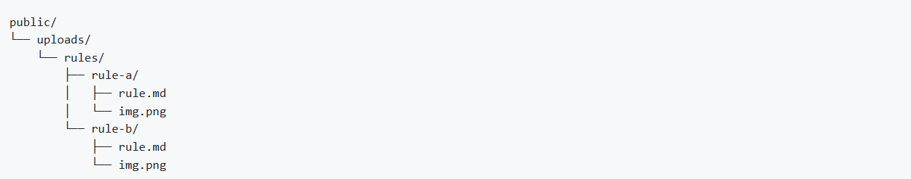

When building a website using **TinaCMS and Next.js**, it’s important to keep your content (Markdown/MDX files) and related images together in the same folder. This makes your project easier to maintain, improves GitHub editing, and supports better portability.

<!--endintro-->

`youtube: https://www.youtube.com/watch?v=G5ax5HIVYTU`  
**Video: Tina.io - The 3 options for storing markdown in GitHub for TinaCMS (5 min)**

By default, Tina stores content in a `/content` folder and images in `/public`, which breaks self-containment and can cause confusion.

---

You have 3 options:

## 1. Default structure

* Content in `/content`
* Images in `/public`
* You must manually manage matching folder names and use frontmatter to point to images.

**✅ Pros**

* Works out of the box  
  
**❌ Cons**

* Not self-contained  
* Prone to errors when renaming/moving files

## 2. Everything inside content folder

* Each rule gets a folder in `/content`
* Images are stored alongside the MDX file

**✅ Pros**

* Fully self-contained  
* Tina Media Manager works  
  
**❌ Cons**

* Requires extra setup: update config, collections, and add a middleware

## 3. Everything inside public folder (✅ Recommended)

* Each rule has a folder in `/public/rules`
* Images and MDX file live together

**✅ Pros**

* Fully self-contained  
* Tina Media Manager works  
* No custom middleware needed
  
**❌ Cons**

* MDX files live in `public`, which is unconventional—but works

This option is clean, simple, and works with Tina’s Media Manager out of the box — no special setup required.

See more on [Tina.io - Storing Media With Content](https://tina.io/docs/guides/storing-media-with-content).
