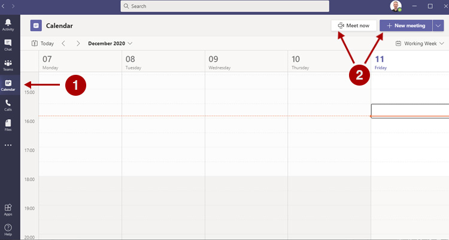
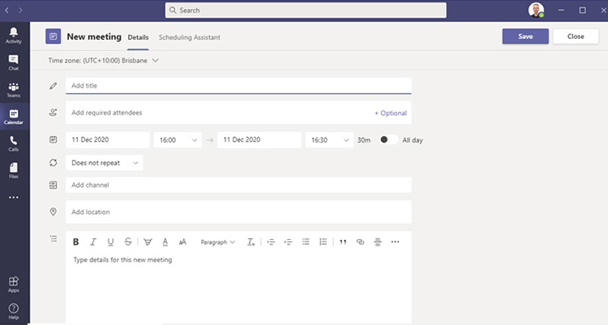
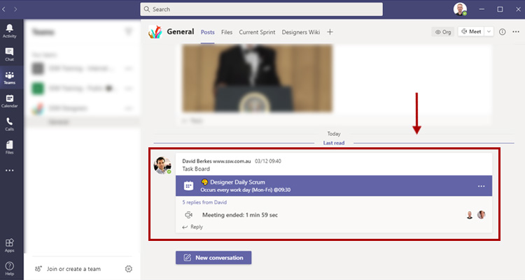

​Sending appointments from Teams feels less natural than from Outlook but there are some great benefits: 
   <ul><li>Appointment -  You don’t need to remember everyone’s name - The whole team is invited</li><li>Appointment - In the appointment, it auto-generates a link so that everyone goes to the right place to attend</li><li>Visibility - It shows up in Teams Calendar</li><li>Visibility - It appears in the Teams chat (for the channel that was invited)</li><li>Visibility – When the appointment is beginning the app pops up with a button to “Join”</li><li>History - If you decide to record the meeting, the link to the recording shows up in the chat history as well </li></ul>

       
   

      <b>Important:</b> Although the meeting app works great to organize Teamwork such as Scrum meetings or other client meetings, it is not very suitable for more global events such as a retreat or a conference. At SSW we use Microsoft Outlook appointments in those instances. 

<dl class="badImage"><dt>
             
             
         </dt><dd>​​Figure: Bad Example - This appointment was created using Outlook using Zoom - the team members needed to be added to the appointment individually and there are too many options on how to join the meeting. </dd></dl>

<dl class="goodImage"><dt>
      
   </dt><dd>​​Figure: Good Example - I know this appointment was created in Microsoft Teams since it was created on behalf of the team (see sender) and at the bottom it has a link so that people can click and join the correct meeting (even without Teams installed) </dd></dl>
 <excerpt class='endintro'></excerpt> 
<dl class="image"><h3 class="ssw15-rteElement-H3">How to make a Teams Meeting </h3><dt> 
        
   </dt><dt>To setup a Teams meeting, simply navigate to "Calendar" and then either "Meet Now" or "New Meeting". </dt><dt> 
      
   </dt><dd>​Figure: Creating a new meeting </dd></dl><dl class="image"><dt>
      
   </dt><dd>Figure: Meeting options</dd></dl>
You can select a Channel to meet in and by doing so, members of the Team in which this channel lives will see a Channel activity that you can click to directly jump in the meeting. 
<dl class="image"><dt>
      ​ </dt><dd>Figure: meeting channel activity</dd></dl>
Microsoft Teams will also send out an email invitation email for the meeting - this is especially useful when inviting people outside your organization.​ 
<h3 class="ssw15-rteElement-H3">Related rule​ </h3>

<ul>
   
   <li>
       
      <a href=/do-you-make-your-team-meetings-easy-to-find>​Do you make your team meetings easy to find?​</a>​ </li></ul>
 

