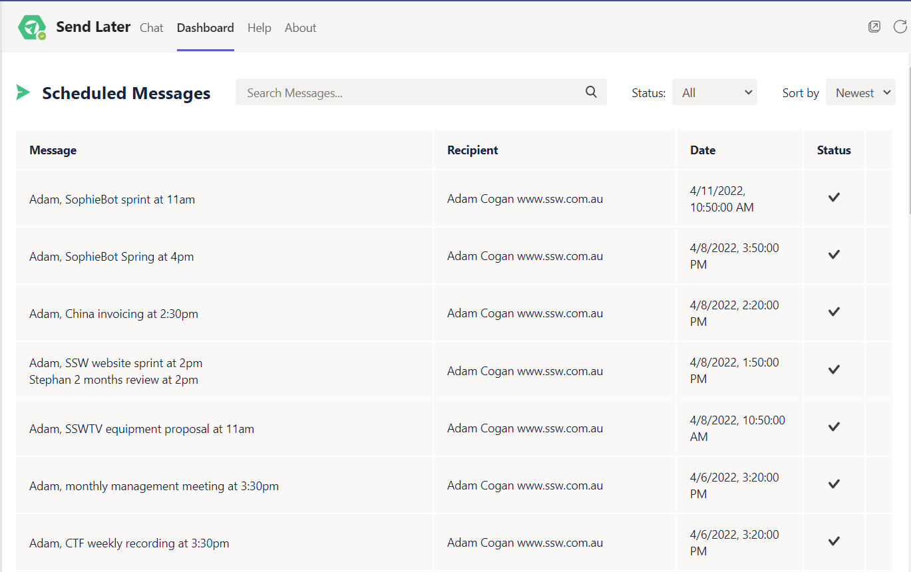

As a Personal Assistant, you are responsible for reminding your manager not to miss any important meetings. However, sometimes your own schedule might get too busy, making you forget to remind your manager; or maybe your manager could be too busy to take your call.  

<!--endintro-->

Here is a practical and useful add-in tool on Teams called ‘[Send Later](https://sendlater.cemble.com/#)’, which allows you to schedule all the important messages in advance, so both your manager and yourself don't miss any timely messages/reminders.

You will be able to schedule the exact date and time your message/post is sent. It can be used for free with up to 2 users, each having a daily limit of 10 scheduled messages. 

::: good

:::
