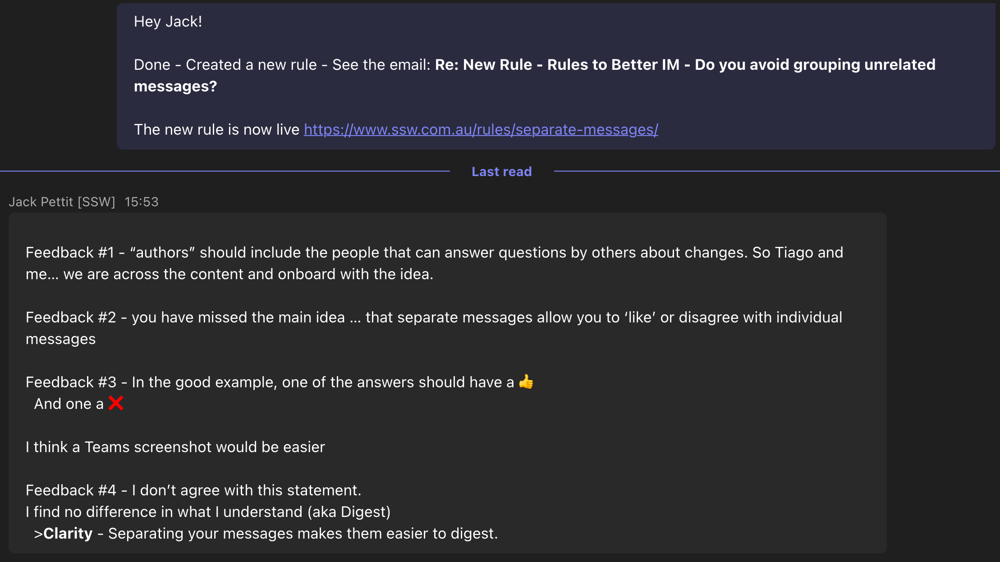
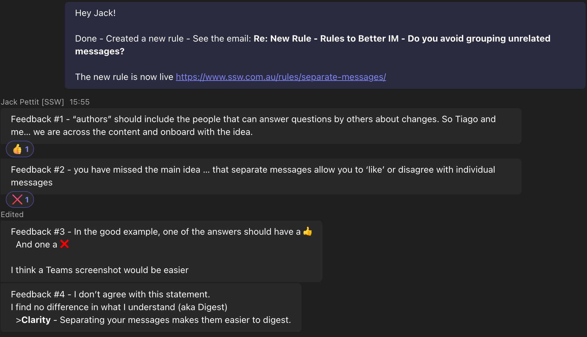

When messaging someone, it's often tempting to send a big block of text, instead of separating your thoughts into separate messages. But did you know that this can make your thoughts difficult to respond to?

<!--endintro-->

### Why separate messages?

When you separate your messages, the people you are messaging will be able to respond or interact with each message separately!

::: bad

:::

::: good

:::

::: greybox
**Note:** When responding to these messages, you should [respond to each point in order](/answer-im-questions-in-order).
:::
