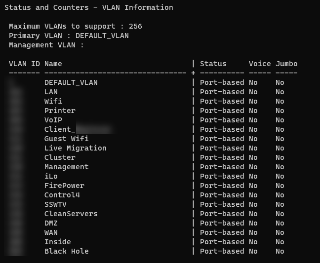
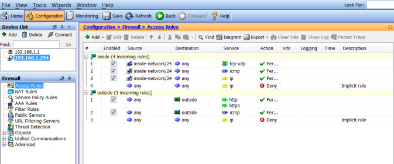

Keeping networks and VLANs separated is an essential aspect of a robust security strategy. This is particularly true for less secure networks such as automation and HVAC systems, which are often targeted by cybercriminals looking to gain unauthorized access to the network.

<!--endintro-->

The following guidelines can help system administrators maintain the separation of VLANs.

### Define VLANs

Assigning different VLANs for different client types and services provides a logical division of the network. This will help ensure that each network is independent, even if they share the same physical infrastructure.

### Implement Security Measures

VLANs should be separated using access control lists and firewalls. Ensure that there are no unauthorized access points between VLANs and that the only devices that can communicate between VLANs are those that are authorized.

By following these guidelines, system administrators can keep networks and VLANs separated while enacting security measures that will prevent unauthorized access to every part of the network. Thus, creating a safer and more secure network environment.