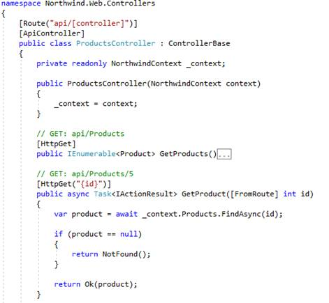
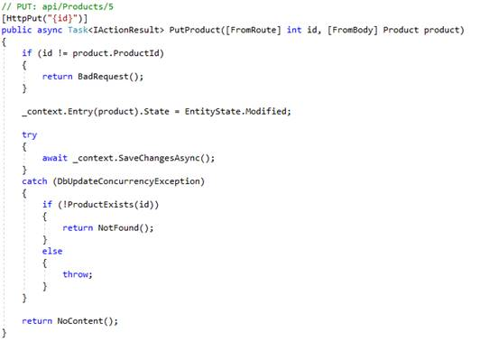
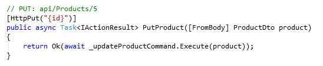
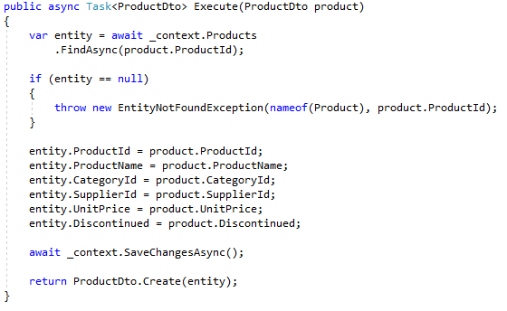
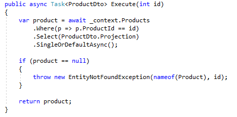
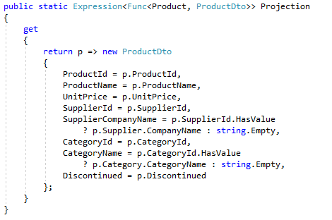

When building a simple API based on Entity Framework, It can be tempting to keep it simple and bind persistent entities directly to WebAPI output.

<!--endintro-->

::: bad  
  
:::

Although this code is very simple to write, there can be a number of potential problems:

* All fields in the entity will be sent to the client. Often there can be for-internal-use-only fields in a domain entity / database table that you do not want sent to the client. Or the particular client use-case does not require the full set of fields
* This might not a performant way of retrieving this data as, by default, the entity will be loaded into dbContext and change tracked. This tracking is unnecessary as the DbContext will be disposed when the request is finished
* Often domain entities can have bidirectional navigation properties and these will fail to serialize to JSON
* If your domain object contains computed properties, they get will be executed when serializing the object

Update operations can be even more problematic:

::: bad  
  
:::

Consider the Product object that is received as a [FromBody] parameter by the action.

At the start of the action this is not a persistent entity that has been loaded from the database and attached to a DBContext. Instead it is an entirely new object that has been created by the MVC databinding system.

The next call to the DbContext will take that object – exactly as received and de-serialized from the network – and attach it as-is to the DBContext in the “Modified” state, to be later saved by the call to SaveChangesAsync()

Any fields that did not survive the "round-trip" from the server -&gt; client-&gt; server will be overwritten / lost. The mapping from "Object received from the web" to "Object saved into the database" is entirely implicit here.

For all these reasons, the use of DTOs or View Models is highly recommended:

* Complex domain objects can be simplified to contain only the exact set of fields required for a view
* Aggregate models can be created that simplify the results from joining related domain objects
* View Models can contain additional information or metadata required by the client such as value lookups
* View models can be extended containing details specific to the current user context such as "Does the current user have the required permissions to delete this item?"
* Update operations can become far more explicit
* Validation rules can be written against the view model and for the specific context the view model exists for
* Consider this to be a case where the Single Responsibility Principle (SRP) generally outweighs Don’t Repeat Yourself (DRY)
* Read operations can be optimised by selecting from DBSets directly into view models

::: good  
  
:::

  

::: good  
  
:::

This approach requires a bit more boiler-plate code as the fields to be updated are applied manually, but there is far less risk of unintended side effects.
As the complexity of the code increases, it will be much easier for developers to keep a clear distinction between ViewModel objects that were received from web requests, and persistent entities that came from Entity Framework.
   

::: good  
  
:::
 
  

::: good  
  
:::

For the above read, Entity Framework will execute an SQL select statement containing only the fields that have been projected via .Select()  
This will also prevent change tracking on the source entity.

The above example also demonstrates how a projection / mapping from an entity to a view model can be reused by creating an Expression&lt;Func&lt;EntityType, ViewModelType&gt;&gt;
