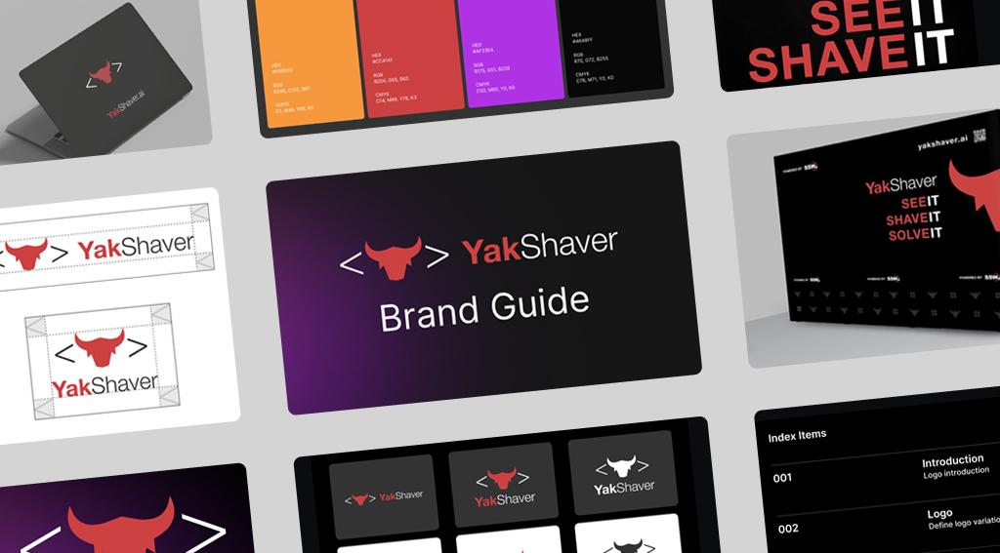

The start point of your branding is the logo. From there everything the company produces or owns should "feel" like it comes from your company. When you walk by a pile of documents on a desk, you should recognize that it's from your company. It's not just plonking the logo everywhere.

These are things to keep in mind for good branding:

<!--endintro-->

* **Logo** - E.g. [SSW Logo](https://www.ssw.com.au/ssw/logo/ssw/)
* **Web fonts** - E.g. At SSW, we use Inter
* **Print fonts** - E.g. At SSW, we use Helvetica Neue
* **[Websites](/rules-to-better-websites-branding-and-marketing)** - E.g. [SSW Web Reference](https://www.ssw.com.au/ssw/company/Web-Reference.aspx) page is an example of good branding instructions for websites
* **Newsletters**
* **[Email signatures](/great-email-signatures)**
* **[Business Cards](/business-cards-branding)**
* **Flyers**, **catalogues**, and other **promotional material**
* **[Products](/products-branding)**
* **Offices** façades, and interior decor
* **[Events](/events-branding)**
* **Documents**, **invoices**, and **proposals**
* **[Employees](/employees-branding)**
* **[Cars](/cars-branding)**
* Others, like **[coffee mugs](/coffee-mugs-branding)**, **[plastic bags](/plastic-bags-branding)**, etc

### Create a well-documented brand guideline 

::: good

:::

See more at [YakShaver Logo and Brand Assets](https://yakshaver.ai/media) and [YakShaver Brand Guide](https://yakshaver.ai/YakShaver/YakShaver-Brand-Guide-V3.pdf).

::: info
**Tip:** Make it easy for designers and developers to find design resources by linking them clearly on your website and intranet.
:::
