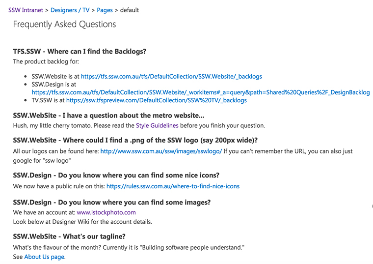

The start point of your branding is the logo. From there everything the company produces or owns should "feel" like it comes from your company. When you walk by a pile of documents on a desk, you should recognize that it's from your company. It's not just plonking the logo everywhere.

These are things to keep in mind for good branding:

<!--endintro-->

* Web Fonts - E.g. At SSW we use Open Sans
* Print Fonts - E.g. At SSW we use Segoe UI
* [Websites](/rules-to-better-websites-branding-and-marketing) 
  View [SSW Web References](https://www.ssw.com.au/ssw/company/Web-Reference.aspx) as an example of good branding instructions for websites
* Newsletters
* [Email signatures](/great-email-signatures)
* [Business Cards](/business-cards-branding)
* Flyers, catalogues and other promotional printing
* [Products](/products-branding)
* Office façade and interior decor
* [Events](/events-branding)
* Documents, invoices and proposals
* [Employees](/employees-branding)
* [Cars](/cars-branding)
* Others, like [coffee mugs](/coffee-mugs-branding), [plastic bags](/plastic-bags-branding) etc

You should help designers to find stuff in your Intranet:

::: good\
\
:::