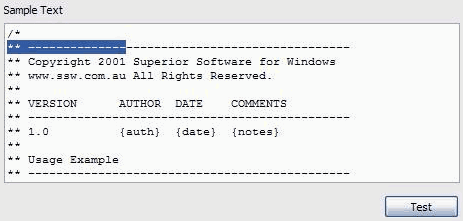
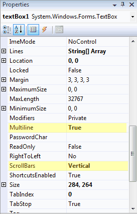

If a TextBox has Multiline set to true, then the ScrollBars property should be set to "Both" or at least "Vertical".

<!--endintro-->

::: bad

:::

:::good

:::

:::good

:::

We have a program called [SSW Code Auditor](https://ssw.com.au/ssw/CodeAuditor/) to check for this rule.
