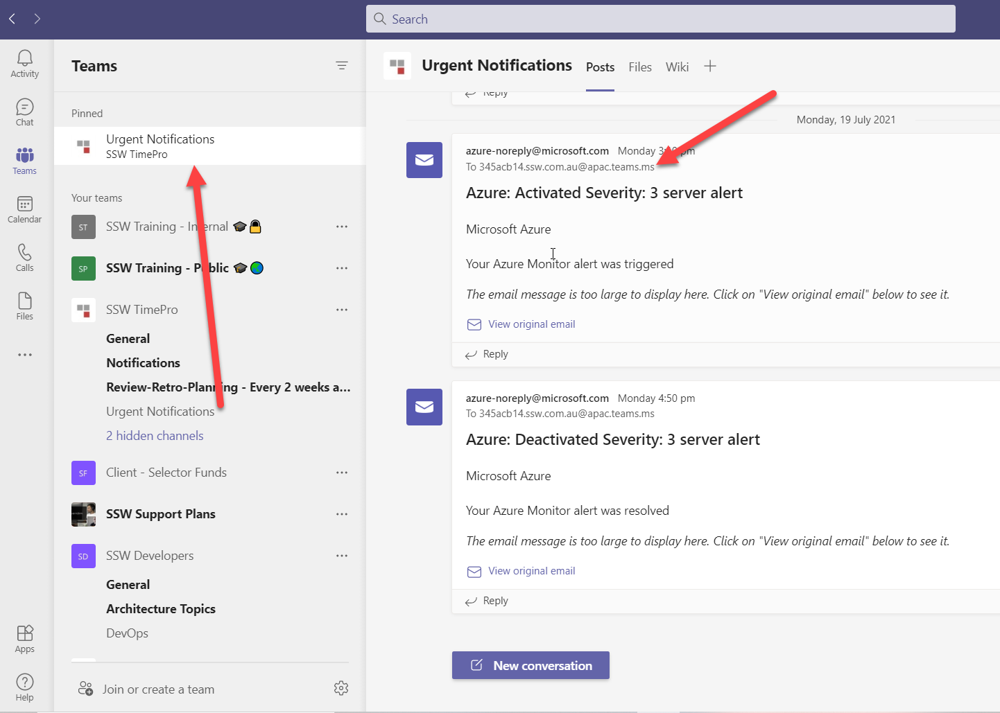

Most sysadmins set up Azure alerts to go to a few people and then they have given themselves a job to forward the email to the right people every time there is a problem. What happens when they are away and why do they need to keep adding and removing emails when people join and leave the team.

<!--endintro-->

There is a better way. Have those emails go to the Team. Every team channel has a specific email address and then Team members can pin that. This way these important emails are sitting right at the top.

:::good

:::