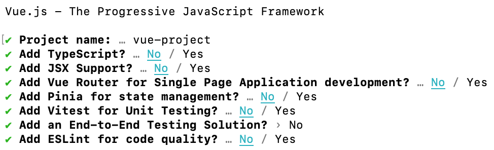

Getting started with a Vue.js project is easy. Here's how you can get up and running quickly:

<!--endintro-->

### create-vue (Recommended)

[create-vue](https://github.com/vuejs/create-vue) is the official and recommended tool for scaffolding a Vue.js project. It uses [vite](https://vitejs.dev/) (also from Vue creator Evan You) to help quickly and easily set up a Vue.js project to your specifications.

**Note:** this requires Node v16 or higher

1. In your command line, run:

   ```
   npm init vue@latest
   ```
2. This will install and run create-vue. It will then prompt you for a project name and step you through a series of prompts for the features you wish to enable:

   
3. When this completes, you're all done! You will now have a Vue.js project set up in a folder matching the project name you set. To get started running a dev server, execute the following:

   ```
   cd {{ PROJECT_NAME }}
   npm install 
   npm run dev
   ```