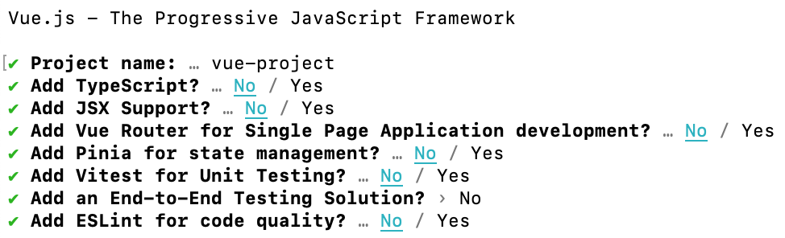
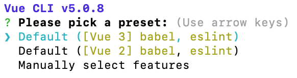
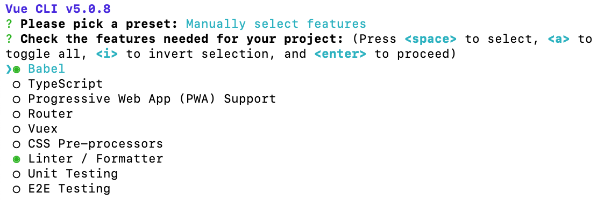

Getting started with a Vue.js project is easy. Here's how you can quickly get up and running:

<!--endintro-->

### create-vue (Recommended)

[create-vue](https://github.com/vuejs/create-vue) is the official and recommended tool for scaffolding a Vue.js project. It uses [Vite](https://vitejs.dev/) (also from Vue creator Evan You) to help quickly and easily set up a Vue.js project to your specifications.

**Note:** This requires Node v16 or higher.

1. In your command line, run:

   ``` shell
   npm init vue@latest
   ```
2. This will install and run create-vue. It will then prompt you for a project name and step you through a series of prompts for the features you wish to enable:

   
3. When this completes, you're all done! You will now have a Vue.js project set up in a folder matching the project name you set. To get started running a dev server, execute the following:

   ``` shell
   cd {{ PROJECT_NAME }}
   npm install 
   npm run dev
   ```

### Vue CLI (Not recommended for new projects)

[Vue CLI](https://cli.vuejs.org/) is the official CLI toolchain for Vue.js development using Webpack. Previously, this was the recommended tool for scaffolding a Vue.js project but is now no longer supported, in favour of create-vue and Vite. Unless your project requires Webpack, it is recommended to use create-vue instead.

**Note:** This requires Node v8.6.0 or higher.

Scaffolding a project in Vue CLI takes just a few steps:

1. Install Vue CLI:

   ``` shell
   npm install -g @vue/cli
   ```
2. Create a new project using "vue create":

   ``` shell
   vue create {{ PROJECT_NAME }}
   ```
3. You will then be presented with a few options. Here you can choose to get up and running using default presets, or you can manually choose what features you want for your project:

   

   
4. Once you've selected your options and allowed it to complete, you'll now have a basic Vue.js project set up in a folder matching the project name you entered. You can get a dev server running by executing the following:

   ``` shell
   cd {{ PROJECT_NAME }}
   npm run serve
   ```