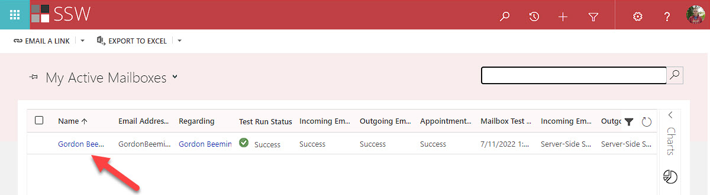

If you want to track appointments and emails in Microsoft Dynamics 365 (CRM), you first need to set up your mailbox in the system.

Do the following:

<!--endintro-->

1. Browse to your Dynamics 365 Online URL | Advanced Settings | Settings | Email Configuration | Mailboxes | Browse for your mailbox:

2. Make sure the following options are set (they might differ a bit depending on your CRM configuration):

   * **Allow to Use Credentials for Email Processing:** Yes
   * **User Name:** &lt;<YourUserName@yourcompany.com>&gt;
   * **Password:** &lt;YourPassword&gt;
   * **Server Profile:** Microsoft Exchange Online
   * **Incoming Mail:** Server-Side Synchronization or Email Router
   * **Outgoing Mail:** Server-Side Synchronization or Email Router
   * **Appointments, Contacts, and Tasks:** Server-Side Synchronization
3. Click  **Test & Enable Mailbox**
   If successful, you will receive an email, if not, contact your nearest SysAdmin
4. Click Save & Close!

If you need more guidance on setting it up, you can find more on Microsoft documentation: [Set incoming and outgoing email synchronization](https://docs.microsoft.com/en-us/dynamics365/customerengagement/on-premises/admin/set-incoming-outgoing-email-synchronization).

After this is done, you should [install the Dynamics 365 App for Outlook](/dynamics-crm-install-the-dynamics-365-app-for-outlook)
