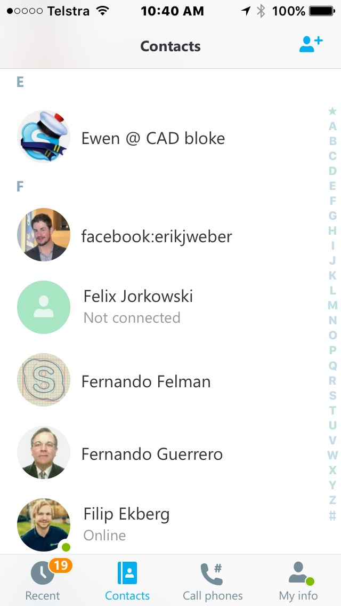

In person conversations are much better than chats over the phone. Skype or Lync calls with video cams are great, but you won’t do that all the time for bandwidth and processing power reasons. The next best thing is to have a great professional picture of yourself. Avoid using a built-in image. 
 <excerpt class='endintro'></excerpt> 
​​<table cellspacing="0" width="100%" class="ssw15-rteTable-default"><tbody><tr class="ssw15-rteTableEvenRow-default"><td class="ssw15-rteTableEvenCol-default" style="width:33.3333%;">​</td><td class="ssw15-rteTableOddCol-default" style="width:33.3333%;text-align:center;">​<strong style="color:#009900;">Good</strong></td><td class="ssw15-rteTableEvenCol-default" style="width:33.3333%;text-align:center;">​<strong style="color:#ff0000;">Bad</strong></td></tr><tr class="ssw15-rteTableOddRow-default"><td class="ssw15-rteTableEvenCol-default">​<strong>Personal</strong> Not default images tha​t comes with Skype</td><td class="ssw15-rteTableOddCol-default" style="text-align:center;">​​​</td><td class="ssw15-rteTableEvenCol-default" style="text-align:center;">​</td></tr><tr class="ssw15-rteTableEvenRow-default"><td class="ssw15-rteTableEvenCol-default"><strong>​Showing entire face</strong>
Ideally, it shows head and top of shoulders close up. Not too far away.
</td><td class="ssw15-rteTableOddCol-default" style="text-align:center;">​</td><td class="ssw15-rteTableEvenCol-default" style="text-align:center;">​</td></tr><tr class="ssw15-rteTableOddRow-default"><td class="ssw15-rteTableEvenCol-default">​<strong>Recognizable</strong>
Your face must not be obstructed with other objects or excessive head cover (e.g. ski mask)
</td><td class="ssw15-rteTableOddCol-default" style="text-align:center;">​</td><td class="ssw15-rteTableEvenCol-default" style="text-align:center;">​</td></tr><tr class="ssw15-rteTableEvenRow-default"><td class="ssw15-rteTableEvenCol-default">
<strong>High quality images</strong>

Not blurred, pixelated, washed out or over-exposed images
</td><td class="ssw15-rteTableOddCol-default" style="text-align:center;">​</td><td class="ssw15-rteTableEvenCol-default" style="text-align:center;">​</td></tr><tr class="ssw15-rteTableOddRow-default"><td class="ssw15-rteTableEvenCol-default">​<strong>An actual photo of yourself</strong>
Not a cartoon, objects or family member(s)
</td><td class="ssw15-rteTableOddCol-default" style="text-align:center;">​</td><td class="ssw15-rteTableEvenCol-default" style="text-align:center;">​</td></tr></tbody></table>
 
<dd class="ssw15-rteElement-FigureNormal">Figure: I see 3 good pictures​</dd>

