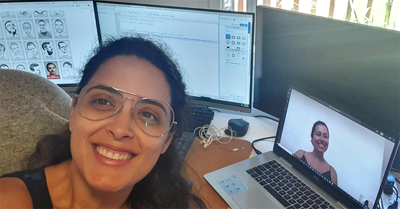

​As a tech company, SSW are pretty well set up for remote work. Our clients require us to work remotely all the time. However, we're not huge on working from home because we love the team to be together. So working from home for the next few weeks was a big decision, but we wanted to keep our people safe.   Like most, we have lots of internal and external meetings, and it's important to maintain our professional look while working solely online. We've learned that it's important to have a good home office setup.   The steps: Get yourself setup and then ask someone from your team to do a ‘test please’ on your background, microphone, audio, lighting, and personal presentation. Once you get a 'Test Passed', you are ready!​ 

 <excerpt class='endintro'></excerpt> 

​If your audio, camera or your microphone are not​ working properly, it’s very likely that you will have your communication affected on a call.  We recommend that you do a test on the platform you are using for your meeting (Microsoft Teams, Skype for Business, etc) and follow their procedure to test your microphone and your audio.

A second option is to call a work colleague and ask them if they can hear and see you well. Good tips are to use headphones and to keep your microphone on mute when not speaking. ​ 
<dl class="image"><dt>
      
   </dt><dd>Figure: Call a work colleague to test your presentation on online calls and make sure it works! </dd></dl>

​​ 

