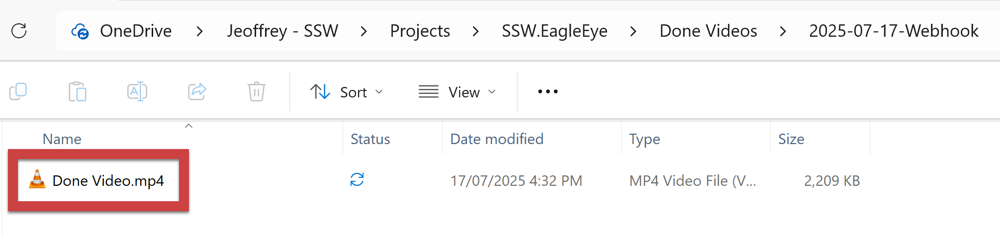
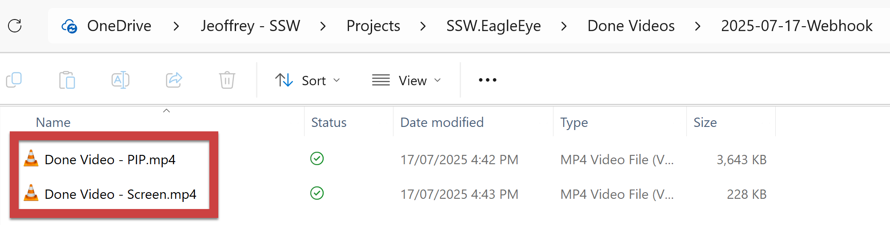
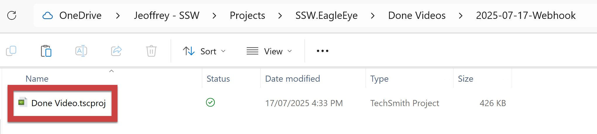

When you ask for changes to a video, it's tempting to just send the exported video and assume the editor can make quick fixes. But without the original project files and media, the editor is stuck with a "flattened" version and can’t properly tweak audio, video timing, or transitions without redoing work or risking quality loss.

<!-- endintro -->

All editing tools have their own way of saving source files. Some editing tools save multiple video files separately. For example, Clipchamp exports two distinct .mp4 files - one for the screen recording and another one for the webcam footage. Other tools, like Camtasia, use a single project file (e.g., .tscproj) that references all the media assets and edits within it. 

Sharing these complete project files or all related media ensures your editor can work efficiently and maintain professional quality.

::: bad

:::

::: good

:::

::: good

:::
