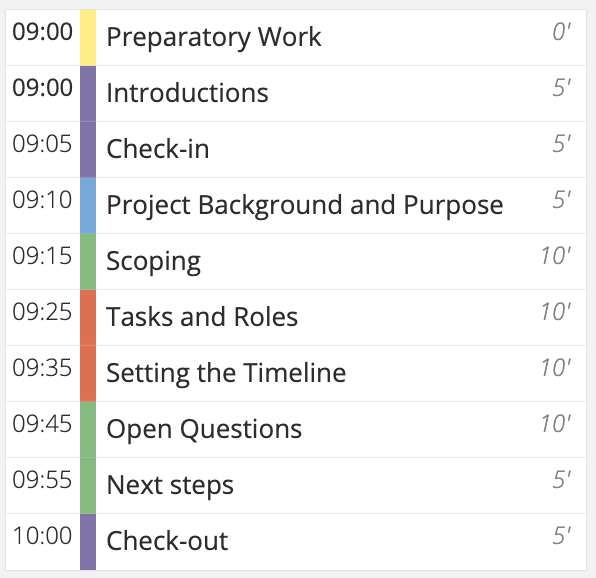

Before a meeting, to give it the best chance of success, you should make sure you have done the following:

<!--endintro-->

* Create a meeting agenda prior to the meeting
  * Give each attendee a copy (usually in the appointment) 
  * If the discussion strays from the topic, everyone should use the agenda to help keep it on track
  * Possibly [mark items on the agenda as “For information,” “For discussion,” or “For decision”](/stick-to-the-agenda-and-complete-the-meetings-goal)
* Send an appointment to all meeting attendees to ensure the meeting appears on their calendar.
* The meeting starts the minute the invite is sent, not when it physically starts.   
  That means read the agenda and prepare. For example if feedback is needed on a large document, give people the link to the document + give advanced warning that  their feedback on the document will be taken ahead of time.
* Make sure all the presentation setup is working.  
  E.g. For SSW they have a '[AV Setup Teams Meetings](https://my.sugarlearning.com/SSW/items/13053/av-setup-for-microsoft-teams-meetings-sydney-chapel)'.
* For attendees, if you are going to be late, contact the organizer or the person in charge of the meeting to let them know that you are running late and what time you will be arriving.

