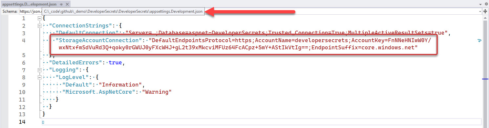
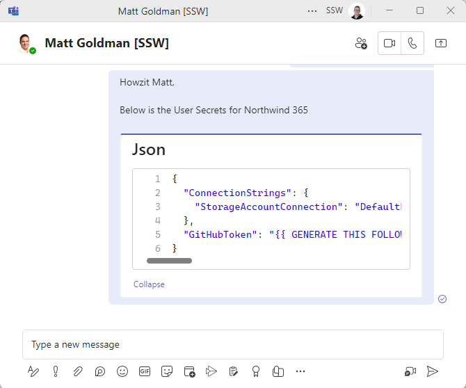
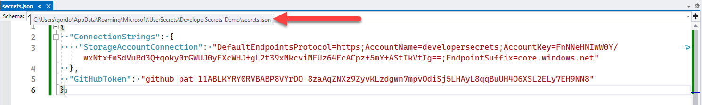
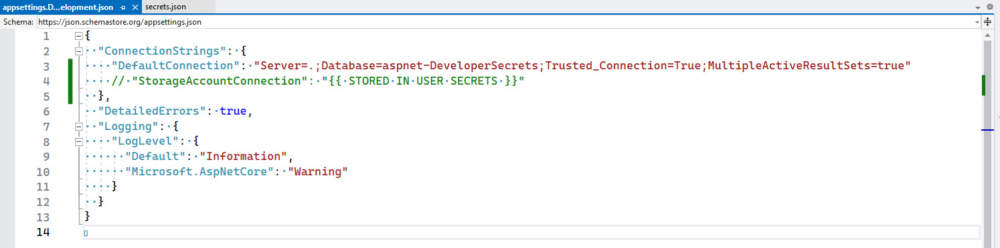
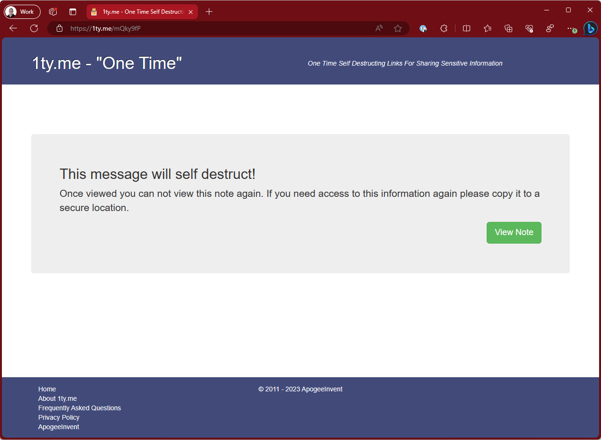
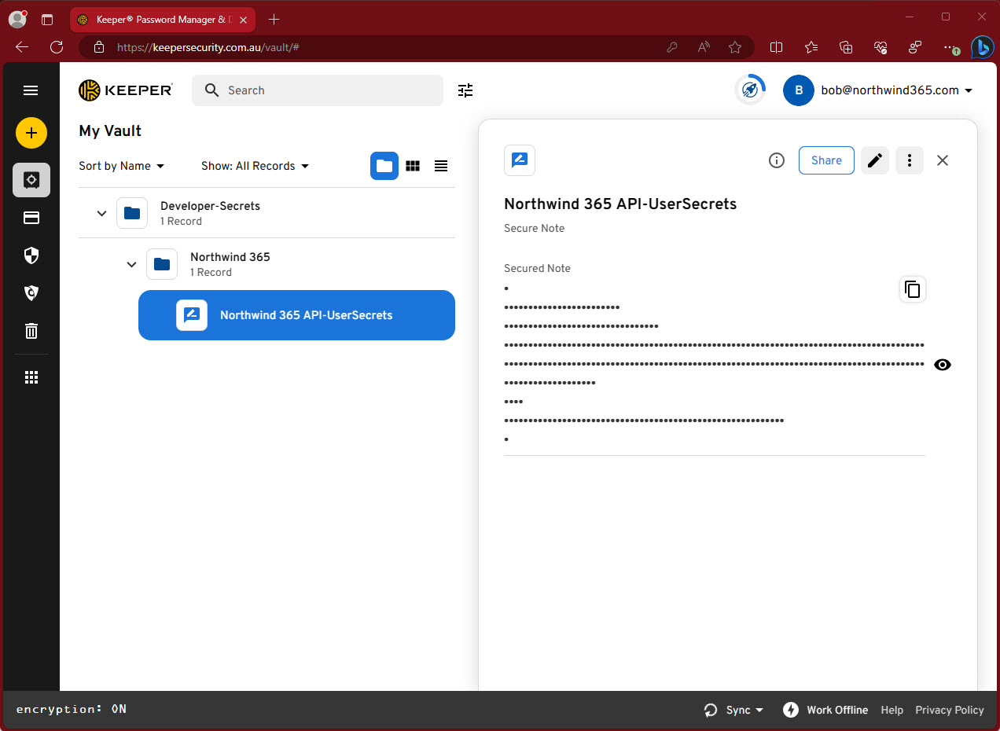

Most systems will have variables that need to be stored securely; OpenId shared secret keys, connection strings, and API tokens to name a few.

These secrets **must not** be stored in source control. It is not secure and means they are sitting out in the open, wherever code has been downloaded, for anyone to see.

[Do you store your secrets securely?](/store-your-secrets-securely/) shows different ways to store your secrets securely. When you use .NET User Secrets, you can store your secrets in a JSON file on your local machine. This is great for development, but how do you share those secrets securely with other developers in your organization?

You may be asking what's a secret for a development environment? A developer secret is any value that would be considered sensitive.

<!--endintro-->

An encryption key or sql connection string to a developer's local machine/container is a good example of something that will not always be sensitive for in a development environment, whereas a GitHub PAT token or Azure Storage SAS token would be considered sensitive as it allows access to company-owned resources outside of the local development machine.

### Bad Examples

::: greybox

#### Do not store secrets in appsettings.Development.json

The `appsettings.Development.json` file is meant for storing development settings. It is not meant for storing secrets. This is a bad practice because it means that the secrets are stored in source control, which is not secure.

:::
::: bad
Figure: Bad practice - Overall rating: 1/10
:::

::: greybox

#### Sharing secrets via email/Microsoft Teams

Sending secrets over Microsoft Teams is a terrible idea, the messages can land up in logs, but they are also stored in the chat history. Developers can delete the messages once copied out, although this extra admin adds friction to the process and is often forgotten.

**Note:** Sending the secrets in email, is less secure and adds even more admin for trying to remove some of the trace of the secret and is probably the least secure way of transferring secrets.

:::
::: bad
Figure: Bad practice - Overall rating: 3/10
:::

### Good Practices

For development purposes once you are using .NET User Secrets you will still need to share them with other developers on the project.

As a way of giving a heads up to other developers on the project, you can add a step in your `_docs\Instructions-Compile.md` file ([Do you make awesome documentation?](/awesome-documentation/)) to inform developers to get a copy of the user secrets. You can also add a placeholder to the `appsettings.Development.json` file to remind developers to add the secrets.

::: good

:::

::: greybox

#### Use 1ty.me to share secrets securely

Using a site like [1ty.me](https://1ty.me/) allows you to share secrets securely with other developers on the project.

Pros:

* Simple to share secrets
* Free

Cons:

* Requires a developer to have a copy of the `secrets.json` file already
* Developers need to remember to add placeholders for developer specific secrets before sharing
* Access Control - Although the link is single use, there's no absolute guarantee that the person opening the link is authorized to do so

:::
::: good
Figure: Good Practice - Overall rating 8/10
:::

::: greybox

#### Use Azure Key Vault

Azure Key Vault is a great way to store secrets securely. It is great for production environments, although for development purposes it means you would have to be online at all times.

Pros:

* Enterprise grade
* Uses industry standard best encryption
* Dynamically cycles secrets
* Access Control - Access granted based on Azure AD permissions - no need to 'securely' share passwords with colleagues

Cons:

* Not able to configure developer specific secrets
* No offline access
* Tightly integrated into Azure so if you are running on another provider or on premises, this may be a concern
* Authentication into Key Vault requires Azure service authentication, which isn't supported in every IDE

:::
::: good
Figure: Good Practice - Overall rating 8/10
:::

::: greybox

#### Use Enterprise Secret Management Tool – Keeper, 1Password, LastPass, Hashicorp Vault, etc... (Recommended)

Enterprise Secret Management tools have are great for storing secrets for various systems across the whole organization. This includes developer secrets

Pros:

* Developers don't need to call other developers to get secrets
* Placeholders can be placed in the stored secrets
* Access Control - Only developers who are authorized to access the secrets can do so

Cons:

* More complex to install and administer
* Paid Service

:::
::: good
Figure: Good Practice - Overall rating 10/10
:::

:::info
**Tip:** You can store the full `secrets.json` file contents in the enterprise secrets management tool.

Most enterprise secrets management tool have the ability to retrieve the secrets via an API, with this you could also store the `UserSecretId` in a field and create a script that updates the secrets easily into the correct `secrets.json` file on your development machine.
:::
