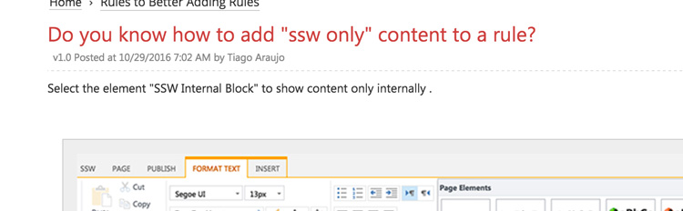

Select the element "SSW Internal Block" to show content only internally.

<!--endintro-->
<dl class="image">&lt;dt&gt;  &lt;/dt&gt;<dd>Figure: Use this "SSW Internal Block" style to insert a section for "SSW Only" content  
       </dd></dl><dl class="image">&lt;dt&gt;&lt;/dt&gt;<dd>Figure: When signed in, you can see "ssw only" content</dd></dl><dl class="image">&lt;dt&gt;&lt;/dt&gt;<dd>Figure: When signed off, you cannot  see "ssw only" content</dd></dl>
**Note:** We have "SSW only content block" feature, however, Rules.SSW is a public website, which means technically the content is accessible through API, so please do not use it for confidential or sensitive info.
