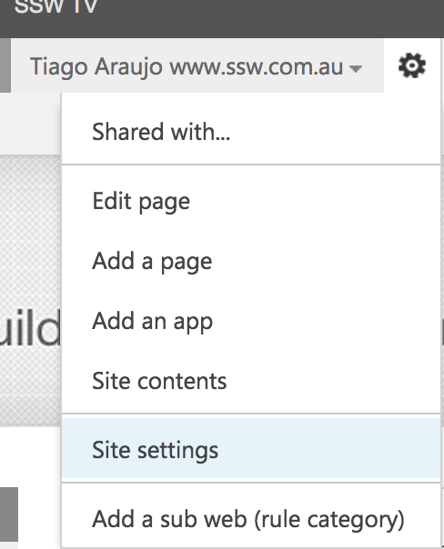

Moving a rule page from a folder to another is not needed anymore. All rule pages are staying in the same library (folder called "Pages") since we moved the rule pages from 100+ subwebs into the root one.

If you want a rule page to be shown on a different rule summary page, simply change the "Rule Category" field value to the relevant one (see step #7 on <a href="/Pages/how-to-create-a-rule.aspx">Do you know how to create a rule?​</a>)

--​

 Sometimes you might need to move a rule from a category to another. You can do this by following these steps:

(Steps 1 and 2 can be skipped by clicking on <a href="/_layouts/15/sitemanager.aspx?Source=%7bWebUrl%7d_layouts/15/settings.aspx" style="color:#cc4141;border-bottom-color:#cc4141;line-height:20.8px;">this link</a> )

 <excerpt class='endintro'></excerpt> 
<ol style="text-decoration:line-through;"><li>​Click on "Site Settings": 
      <dl class="image" style="text-decoration:line-through;"><dt>
            ​ </dt><dd>Figure: Make sure you are logged in and click on "Site Settings"</dd></dl></li><li>Under "Site Administration", click on "Content and structure": 
      <dl class="image" style="text-decoration:line-through;"><dt>
            
         </dt><dd>Figure: Go to "Content and structure"</dd></dl></li><li>Navigate on the categories and pages to find the rule you want to move: 
      <dl class="image" style="text-decoration:line-through;"><dt>
            
         </dt><dd>Figure: Find the rule to be moved and click on the small arrow beside it, then click on "Move..."</dd></dl></li><li>Select the new location where the rule should be: 
      <dl class="image" style="text-decoration:line-through;"><dt>
            
         </dt><dd>Figure: Navigate through categories and click on the place the rule should be moved to​ and click "OK"</dd></dl></li></ol>​

