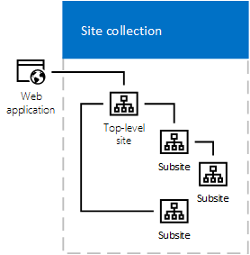

In the days of classic SharePoint, subsites were a popular way of organising your intranet. Modern SharePoint architecture leans toward a flatter hierarchy, where sub-sites are generally not recommended.

<!--endintro-->

::: bad

:::

::: good

:::

There are several reasons why sub-sites are no longer recommended. [Callum Crowley talks about some of the important benefits](https://callum.technology/2021/05/still-using-subsites-in-sharepoint-online-5-reasons-to-move-to-flat-architecture/) including:

**Flexibility** – Sub-sites are a pain to move - you'll never need to do this with a flat hierarchy. Using Hub sites, it’s easy to change links and use dynamic content to make sure your SharePoint architecture matches your organisational structure. 

**Microsoft Teams & 365 Groups** – Every Microsoft Team you create has its own SharePoint site, and SharePoint integrates with Microsoft 365 groups. So with a flat hierarchy, users and admins have a consistent experience across apps and Document Libraries.  

It is worth noting that this flexibility comes at a cost - permissions can be more difficult to manage, as each site will need permissions set separately, and you cannot use nested groups.

- - -

### Links

[Introduction to SharePoint information architecture - SharePoint in Microsoft 365 | Microsoft Docs](https://docs.microsoft.com/en-us/sharepoint/information-architecture-modern-experience#guiding-principle-the-world-is-flat)