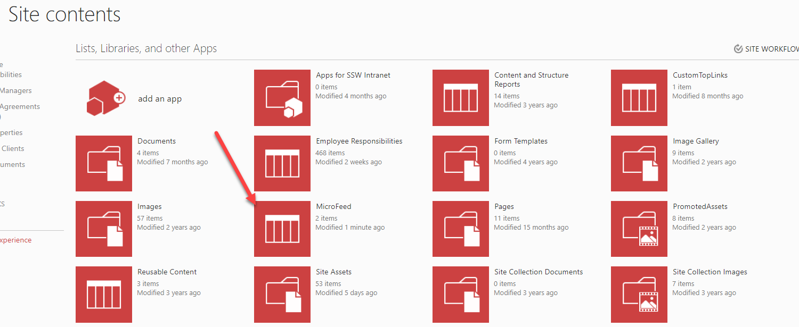
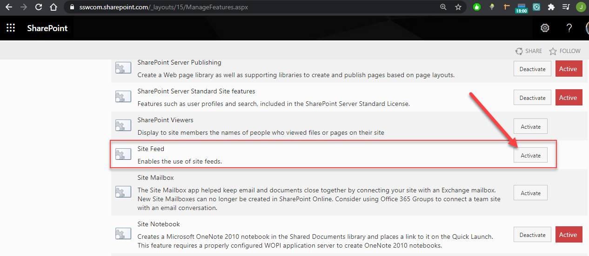
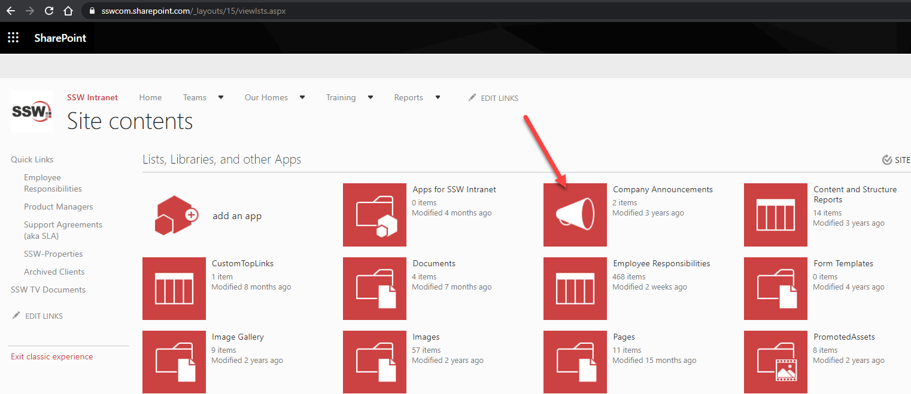
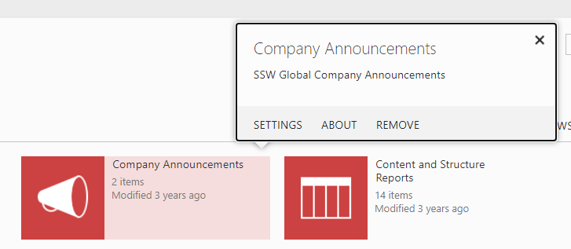
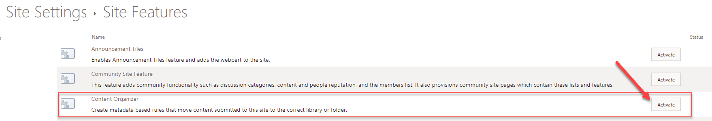
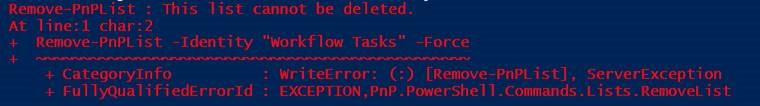
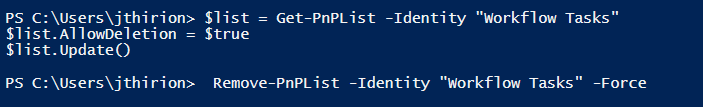

Get rid of classic features in SharePoint Online.

<!--endintro-->

### Microfeed


Microfeed list is used to support the MicroFeed Classic web part. If you’re using Modern SharePoint Sites and Pages (and you should !) everywhere, you don’t need that list anymore.

To delete the Microfeed List, simply de-activate the Site Feed feature at the Web level:

  

  

### Company Announcements

"Announcements" is a default List that used to be created with classic Team Sites. If you’re not using it, chances are you will never do, and modern News should be your replacement for it.

  

To remove company News, click “Settings” | “Remove” from Site Contents:

  

### Drop Off Library

Drop Off Libraries (Content Organizer feature) were a way to automate moving documents around based on Metadata. This is no longer the optimal solution and you should use Power Automate instead. To remove Drop Off Library from your site, you need to disable the “Content Organizer” Web level feature:

  

### Deleting leftovers from Migrations


After migrating content from older versions of SharePoint, you may end up in a hybrid state where the abovementioned features are disabled, but associated libraries/lists are still present on your site. If that happens, you ideally want to clean it up.
The first thing you can try is enabling/disabling the feature again. In some cases, that will fix the issue and remove the unwanted list/library.
If that doesn’t work, however, there is a more radical approach: removing the list/library using Powershell:

  

(In case you prefer using code straight away instead of the screenshot)

```pwsh
Remove-PnPList -Identity "Workflow Tasks" -Force
```

However, on system Lists, you may get an error:

  

The workaround is to set the “AllowDeletion” flag to true before calling delete:

  

(In case you prefer using code straight away instead of the screenshot)

```pwsh
$list = Get-PnPList -Identity "Workflow Tasks"
$list.AllowDeletion = $true
$list.Update()
Remove-PnPList -Identity "Workflow Tasks" -Force
```
