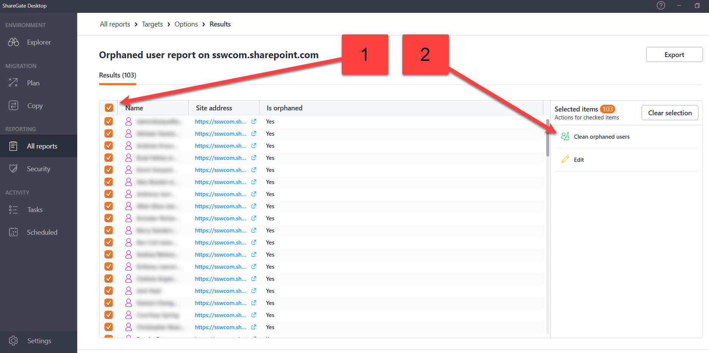
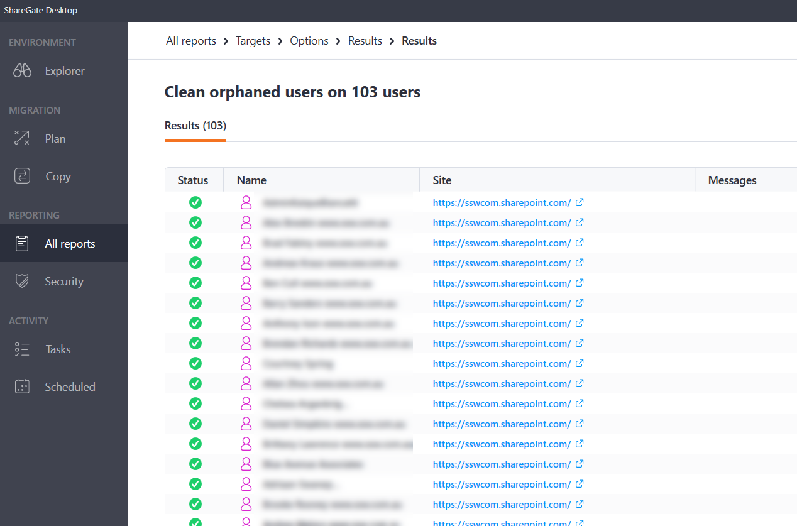

Did you know that when you delete or disable a user in Active Directory or Azure Active Directory the user is still stored in SharePoint.  Did you also know that SharePoint retains any permissions that the user did have in SharePoint at the time?  This means that if the user returns and their account is re-enabled they will have all of the same permissions that they had before.  Luckily for us ShareGate offer us an easy way to remove these 'orphaned users'.

<!--endintro-->

1. Open Sharegate Desktop
2. Click All reports | Orphaned user report

      
   **Figure: Orphaned user report**
3. Add your connection

   

   **Figure: Add connection**
4. Add your site address, Choose your Authentication method and press Connect

   

   **Figure: Connect to your environment**
5. **Choose Navigate to choose individual sites or tick the box to choose all sites and teams folders**

   

   **Figure: Choose navigate or tick**
6. Under Navigate choose the individual site | Click Next

   

   **Figure: Choose site**
7. Click Run now

   

   **Figure: Choose Run now**
8. Select Users | Select Clean orphaned users

   

   **Figure: Clean orphaned users**
9. Click Continue

   

   **Figure: Continue**
10. View results of report

    