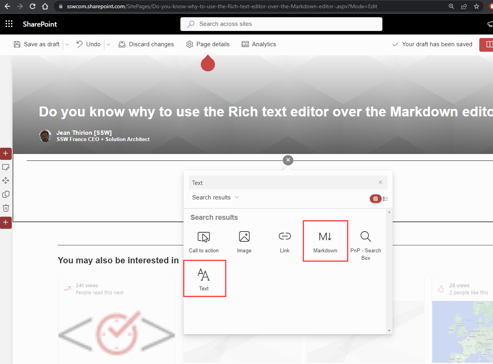
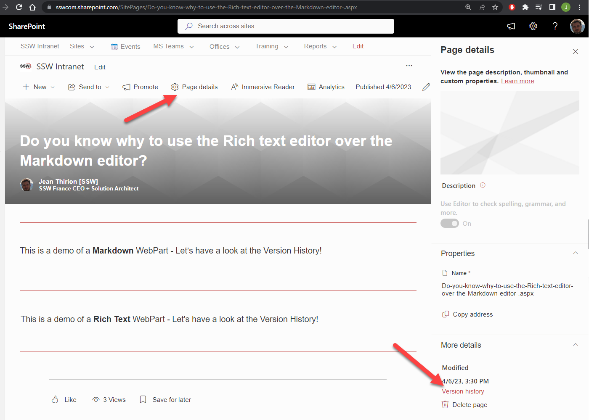
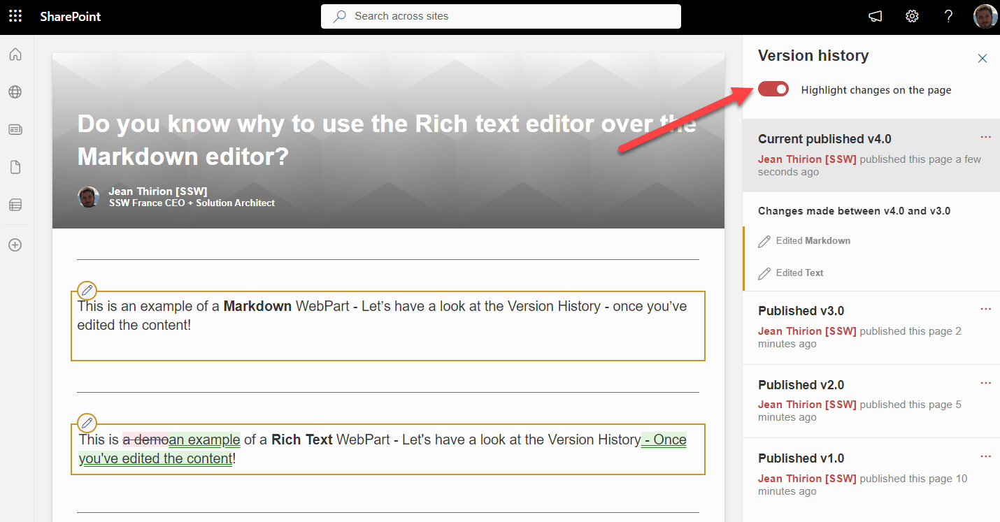
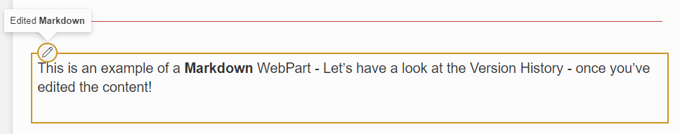
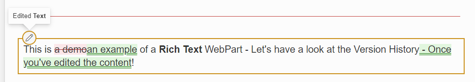

When creating a SharePoint Modern page, you can use many different webparts to enrich your content - Videos, Embedded PowerBI, and many more. 

When you want to add plain text to a page, you have two choices: Text (or Rich Text) Webpart, or Markdown WebPart.    

<!--endintro-->

`youtube: https://www.youtube.com/watch?v=kDZCbRJma60`

Whenever possible, you should use the Text WebPart as it offers a much nicer editing experience, but more importantly provides a detailed Version History.

::: good

:::

::: bad

:::

::: good

:::