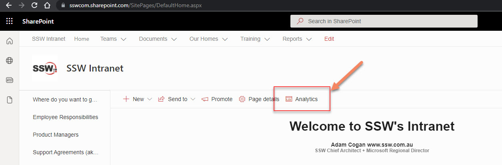
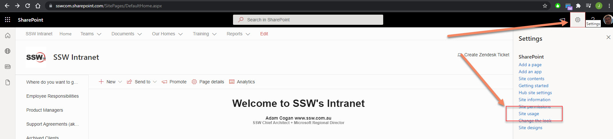
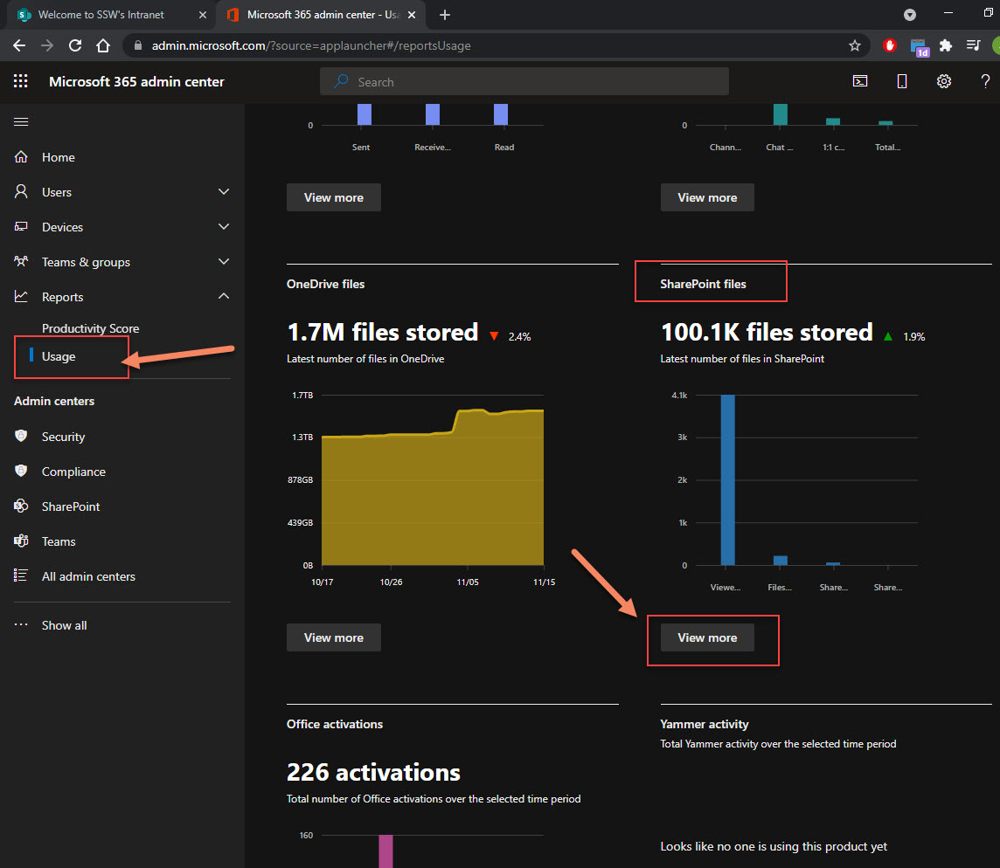
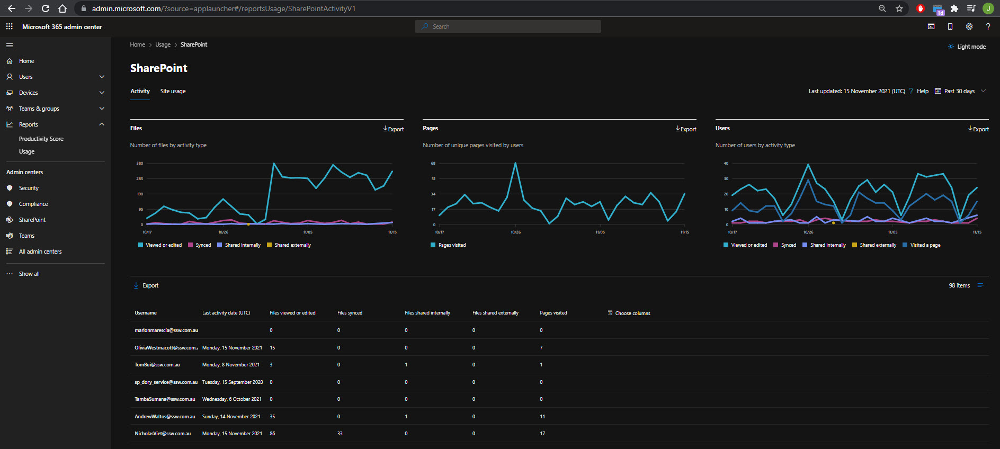

Usage analytics is quite important - it allows you to identify popular and unused pages or sites, but also helps measuring users' engagement.

There are three places to check for Usage reports in SharePoint

<!--endintro-->

1. Page Usage

  

2. Site Usage

Site owners can access global site usage reports:

  

3. Tenant Usage

This is by far the most interesting and import report. You need special (tenant-level) permissions to access those usage reports (https://admin.microsoft.com/?source=applauncher#/reportsUsage/SharePointActivityV1)

  

****

Now enjoy the full power of SharePoint usage analytics !

  

⚠ You will need SysAdmin help to get access to those reports⚠
