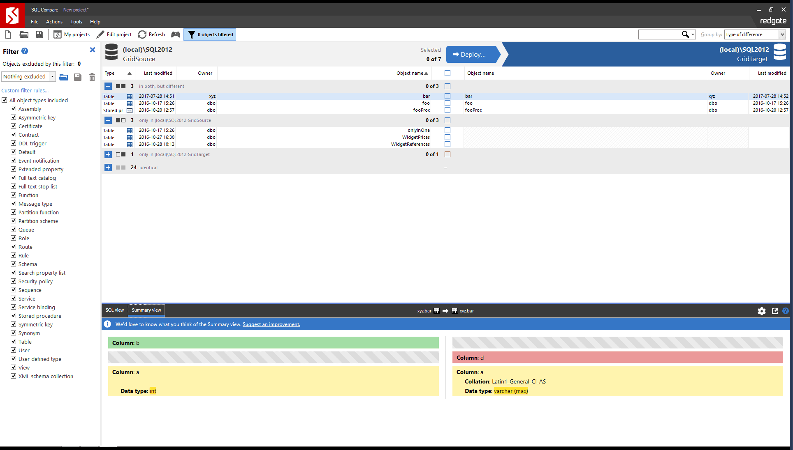
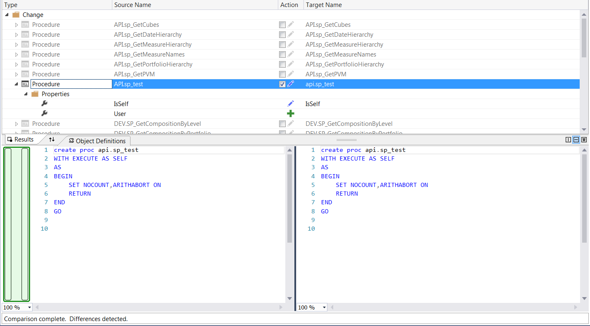

SQL Compare is a good tool to find out the differences between two databases. It can help you answer the question "Is your database the same as mine?". 

However, if you are doing this at the end of your release cycle, you have a problem.  Your schema deployment process is broken...

<!--endintro-->

What you should be doing is seeing your [Schema Master](/have-a-schema-master "Database Schema Master") each time you have a new .sql file. You do this **during the development process**, not at the end in the package and deployment process.

::: greybox
**Tip:** If you are using modern methods such as Entity Framework code first migrations you will already be doing most of this.
:::

Tools like [Red Gates SQL Compare](https://www.red-gate.com/products/sql-development/sql-compare/) and [Microsoft's Schema Compare (aka Data Dude)](https://docs.microsoft.com/en-us/sql/ssdt/how-to-use-schema-compare-to-compare-different-database-definitions) will compare schemas really well but aren't useful when you are deploying as it won't be repeatable. 

  

  

