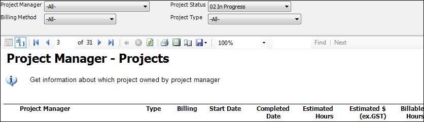
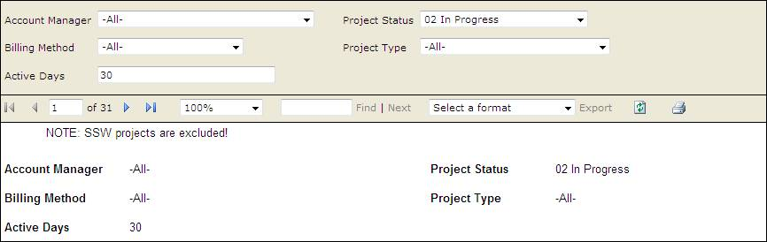

It is much better to display all of the report parameters in report body, because it will be clear for users to know what they search not only in IE but also in exported file (PDF, Excel).
<!--endintro-->

::: bad  
  
:::

::: good  
 
:::
