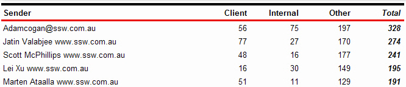
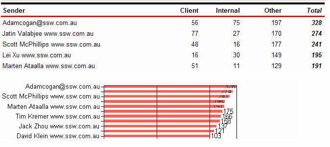
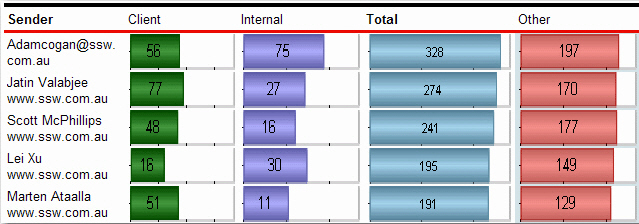

Users of the report service will find the data easier to understand and compare. However, in order for the report to be understandable, the data and chart must be clear and uncluttered.

<!--endintro-->

::: bad  
  
:::

::: bad  
  
:::

::: good  

:::
