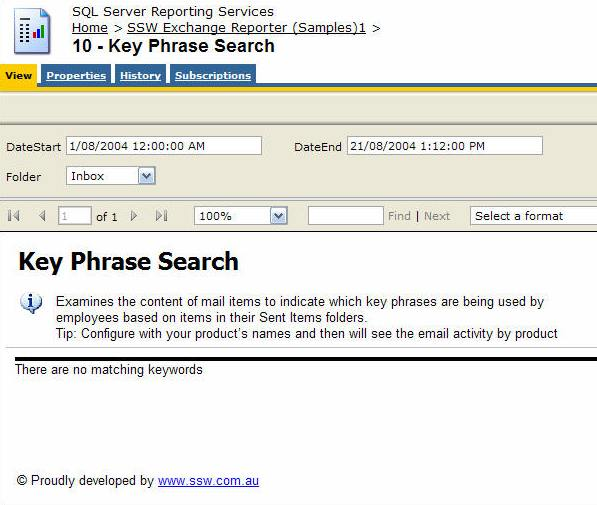
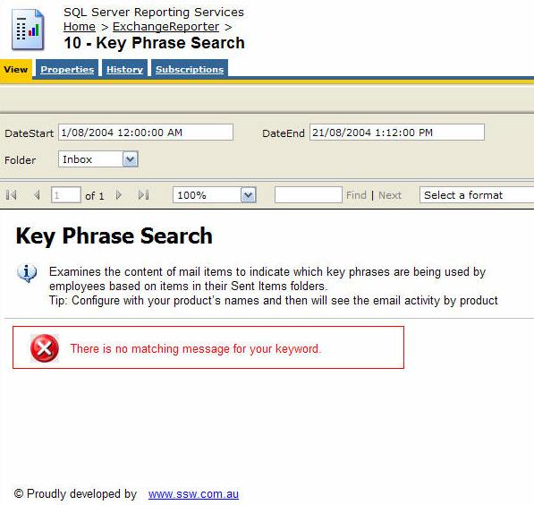
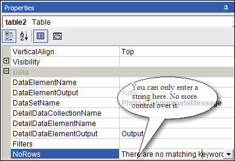
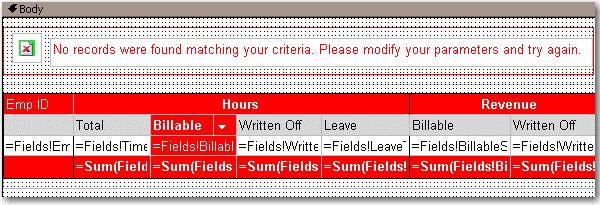
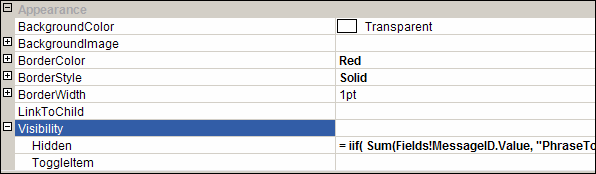

<!--endintro-->

Errors on reports should not occur but when they do it is best to make it clear to the reader that they have just experienced an error.
How evident are the error messages on the 1st report below?

::: bad  
  
:::

::: good  

:::

Reporting Services allows you to set the 'NoRows' property of a table control to warn your user when there is no data available. This is similar to handle the 'NoData event' in Access report but there is no advanced control on this message, not even a Color property - this has not been improved in RS2005, see our [Better Software Suggestions page](https://www.ssw.com.au/ssw/Standards/Rules/RulesToBetterSQLReportingServices.aspx#Subscription).



Here's how to add a custom "NoData" textbox with a red icon to your report:

1. Add a rectangle to the top of your report, above any report items in the body. Set its **BorderColor** to **Red**.

2. Drop a textbox into the rectangle and give it the value **No records were found matching your criteria. Please modify your parameters and try again.**

3. Add an Image control next to it. Use [this error icon](https://www.ssw.com.au/ssw/Images/ErrorMessage/fatal_error_info.gif) This opens in a New Window as the Image (add it to your Images folder in your solution and reference it like **Images/fatal_error_info.gif**). Your report will now look similar to the one below.



4. In the **Hidden** property of the **Rectangle**, add an expression to show/hide it depending on whether any rows were returned. Use the following expression, substituting the bold for your own values (e.g. checking if the sum of all orders is < 0)

```sql
--Expression to set the visibility of the error message controls

= iif( Sum(Fields!SaleTotal.Value, "MyDataSet")>0, True, False)
```



5. Group all other report items into a rectangle - you want to be able to show and hide them dynamically.

6. In the **Hidden** property of this **Rectangle**, add an expression to show/hide it depending on whether any rows were returned. Switch the True and False values around, so that it shows if it does have records, and hides if it does not have records (the opposite behaviour to the error box). So, in the example above, the expression would be:

```sql
--Expression to set the visibility of the main report items

= iif( Sum(Fields!SaleTotal.Value, "MyDataSet")>0, **False**, **True**)
```
