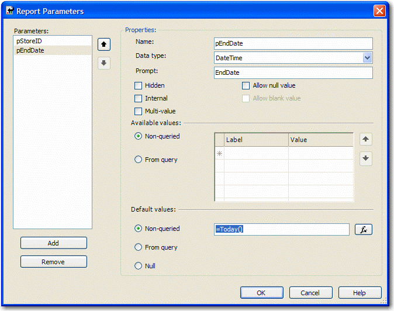

When you are working with reports that use time-based data (sales figures, employee productivity etc.), it is handy to see how you went this month compared to the past 6 months. The best way to show this is on a bar chart.

<!--endintro-->

::: good  

:::

To do this:

1. Create a new dataset in your report.

2. Enter the following query, substituting "MyDate" for the name of the date field you are referencing, "MyTable" for the view or table you are selecting from, and "@pEndDate" for the name of the report parameter you are using for the data end date:

```sql
SELECT DISTINCT TOP 6
  CONVERT(varchar(12), Year(MyDate), 101) + '-' + RIGHT('0' + Convert(Varchar(2), MyDate, 101), 2) AS Y
  , Sum(PaidTotal) * -1 AS Total
FROM
  MyTable
WHERE
  MyDate BETWEEN DateAdd(Month,-5,convert(varchar(12), Month(@pEndDate)) + '/1/' + convert(varchar(12), Year(@pEndDate))) AND 
CASE WHEN datepart(d,@pEndDate) = 1 THEN DateAdd(d, 1, @pEndDate) ELSE @pEndDate END
GROUP BY
  CONVERT(varchar(12), Year(MyDate), 101) + '-' + RIGHT('0' + Convert(Varchar(2), MyDate, 101), 2)
ORDER BY
  CONVERT(varchar(12), Year(MyDate), 101) + '-' + RIGHT('0' + Convert(Varchar(2), MyDate, 101), 2)
```

3. Configure the new added parameter 'pEndDate'



4. Add a chart to your report in Layout view and change its type to "Simple Column".

5. Drag the "Total" field from the Datasets window into the Data area on the chart, and the "Y" field into the Category area. Your chart will now look similar to the one below.


6. Now you need to set the last column to be a different color so it stands out. Right-click the chart and click Properties.

7. Click the "Data" tab, click "Edit..." next to the "Values" box, then go to the "Appearance" tab and click "Series Style..." then the "Fill" tab.

8. In the "Color" textbox, enter this expression, then OK all dialogs to return to the report:

```sql
=iif(Right(Fields!Y.Value, 2)=Month(Parameters!pEndDate.Value), "Blue", "Green")
```
