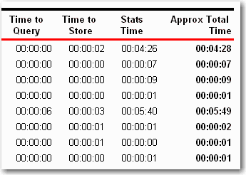
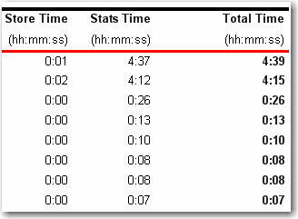

It will give a professional look for your report to show time in a clear and consistant format.
<!--endintro-->

::: bad  
  
:::

::: good  
 
:::

A related rule about time format is [Do you keep Time formats consistent across your application?](https://www.ssw.com.au/rules/designandpresentation/rulestobetterinterfacesreports/pages/default.aspx#TimePrecision)