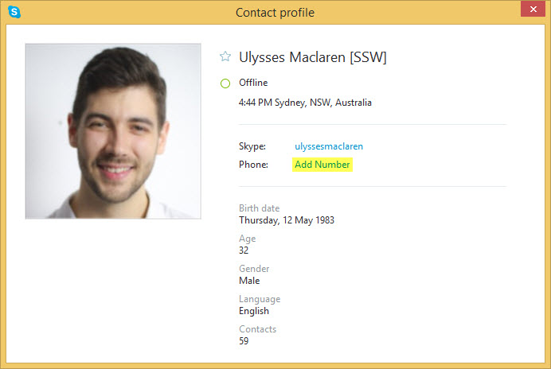
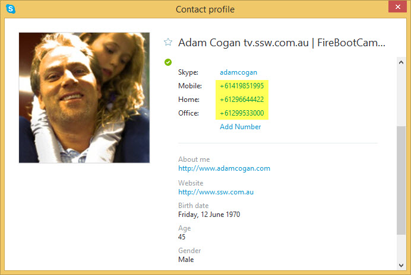
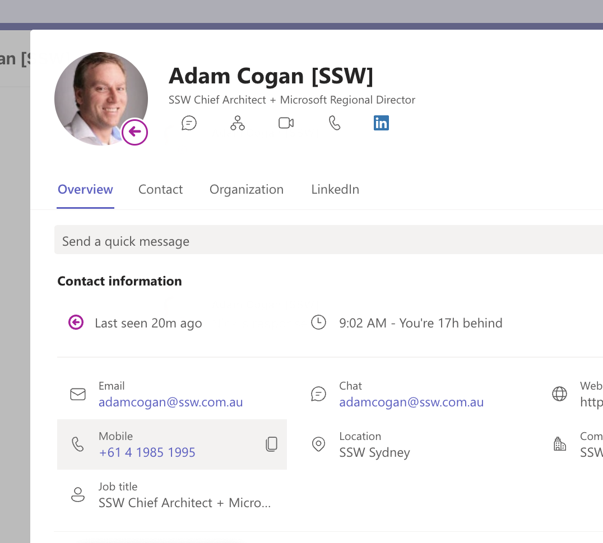

Using instant messages applications is all about communication. If something is urgent and you are not answering IMs, it is likely the next thing the person will do is to start looking for your phone number.

<!--endintro-->

### Skype

Make it easy for them by adding your phone number to your Skype profile.

::: bad

:::

::: good

:::

**Note:** Before you make phone calls, see [Do you prepare, then confirm conversations/decisions?](/do-you-prepare-then-confirm-conversations-decisions)

### Teams

