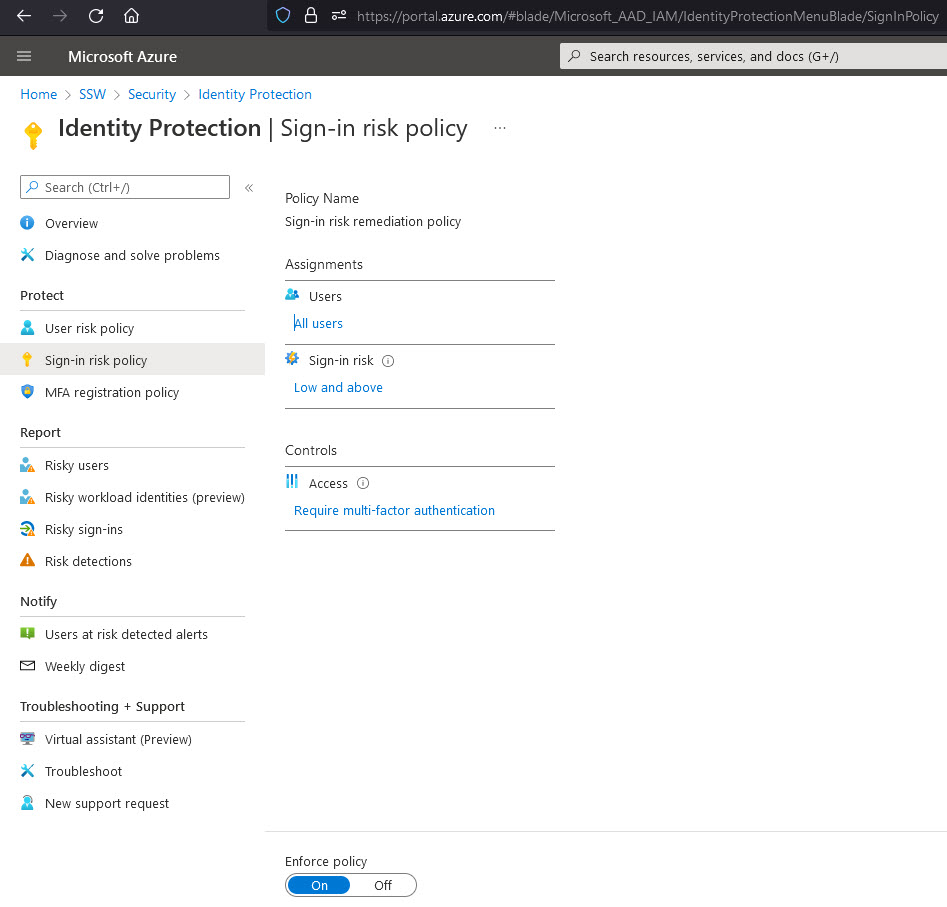

Azure Active Directory (AD) Identity Protection's Sign-in risk policy helps automatically protect your users from risky sign ins to their accounts.        

<!--endintro-->

Azure AD has many built-in solutions to protect legitimate users from malicious actors trying to sign in to their accounts via Azure AD, one of them being Sign-in risk policy.

This policy can either fully block access or require a multi-factor authentication (MFA) for the user to be able to login, depending on the the sign-in risk level (High, Medium and above or Low and above).

The level is determined automatically by a series of factors, including:

1. Atypical travel e.g. If a user has logged in from Australia and then authenticates from Europe in the next 5 minutes, an impossible travel to physically make
2. Unfamiliar sign-in properties e.g. If a user has logged in from a location that he never logged on from before
3. And other, constantly updated factors.

When setting this up, you can also choose to apply this to all your users, selected individuals or groups, and exclude users.

You can read more on how to enable these policies on https://docs.microsoft.com/en-us/azure/active-directory/identity-protection/howto-identity-protection-configure-risk-policies