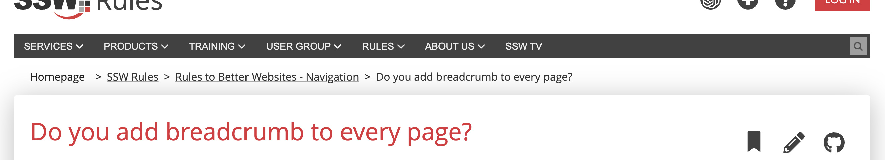
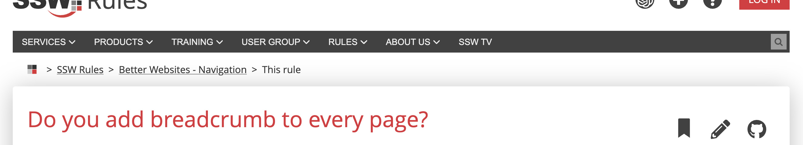

Breadcrumbs are an essential part of website navigation, providing users with a trail of links to indicate their location within a site's hierarchy. To maximize their effectiveness, it's important to keep breadcrumbs short and concise. By simplifying them, we reduce confusion and make them easier to understand, improving the overall user experience.

<!--endintro-->

Shortening breadcrumbs helps prevent information overload, ensuring that users can quickly scan and comprehend the trail without feeling overwhelmed by long and repeated texts. Some ways to achieve that:

* Replace "Home" with an icon
* Keep only the main words for categories
* Replace the current page title with "This Page"

::: bad

:::

::: good

:::
