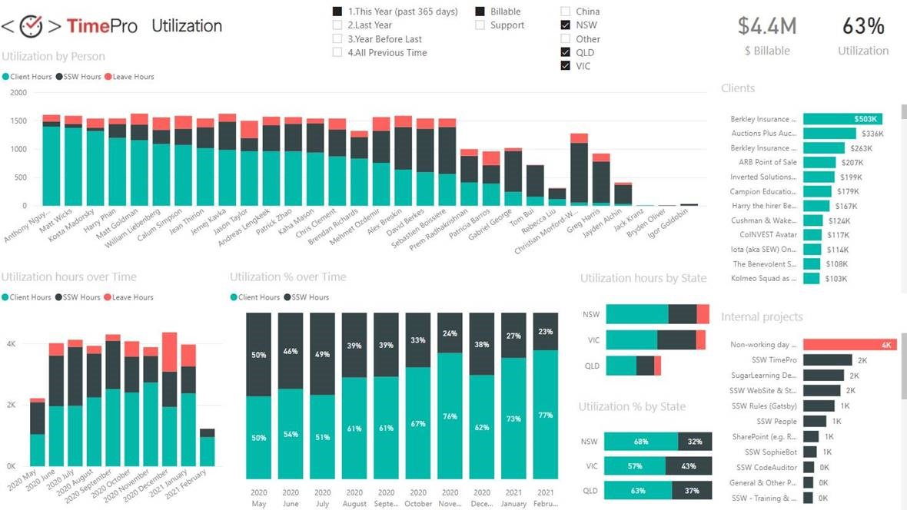
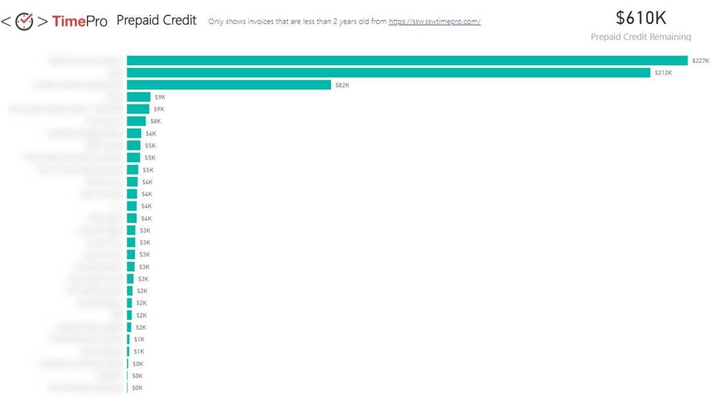
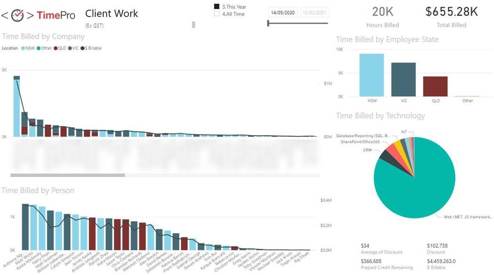

Many reports are expanding on what could be expressed as a single number. When this is the case, make sure that number is clear and bold at the top right of the report.

Ideally this should be a single number, not a group of numbers. If there is more than one, make sure one is chosen as the main one and put the others in a less prominent colour, size, or position.

<!--endintro-->

