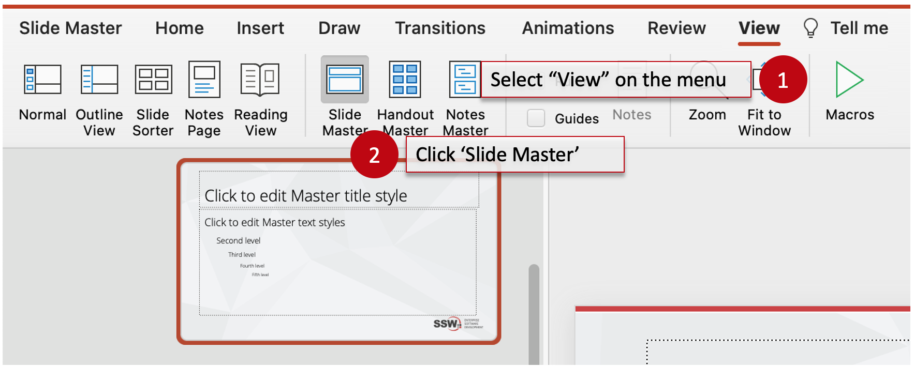
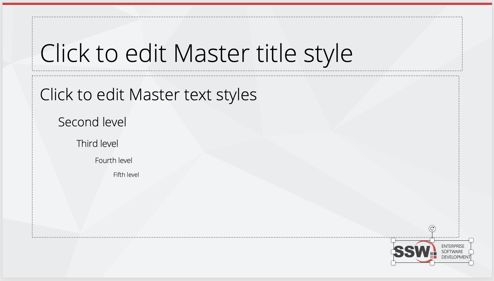

Add your logo and tagline for branding purposes. The tagline concept is to use a catchphrase that will sum up the tone of a brand and to reinforce the audience's memory of your company/product.

Neither of these elements are intended to distract, so they are placed subtly in the footer of the slide. It is present, but the influence is tiny and your audience's focus will remain squarely on the content.

<!--endintro-->

::: good

:::

### How to do it

Adding the tagline and logo in the Slide Master will replicate it automatically across all slides. The master will also dictate the size and font of text present on all slides.

