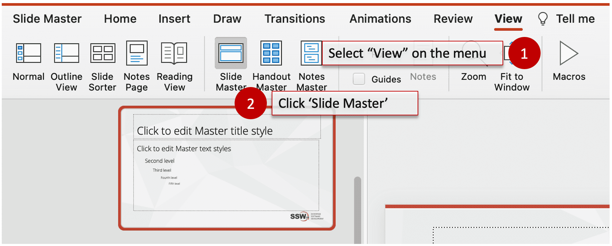
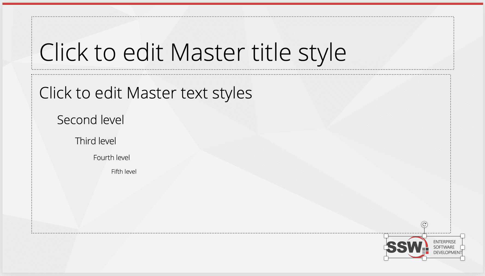

Add your logo and tagline for marketing purposes. The general concept is to use a catchphrase that will sum up the tone of a brand and to reinforce the audience's memory of your company/product.

Neither of these elements are intended to distract, so they are placed in the footer of the slide. It is present, but the influence is subtle and your audience's focus will remain squarely on the content.

<!--endintro-->

## More Information: Do you know the way to add the tag line into slide master?

Adding the tag line and logo in the slide master will duplicate it automatically across all slides. This will dictate the size and font of text present on all slides.

