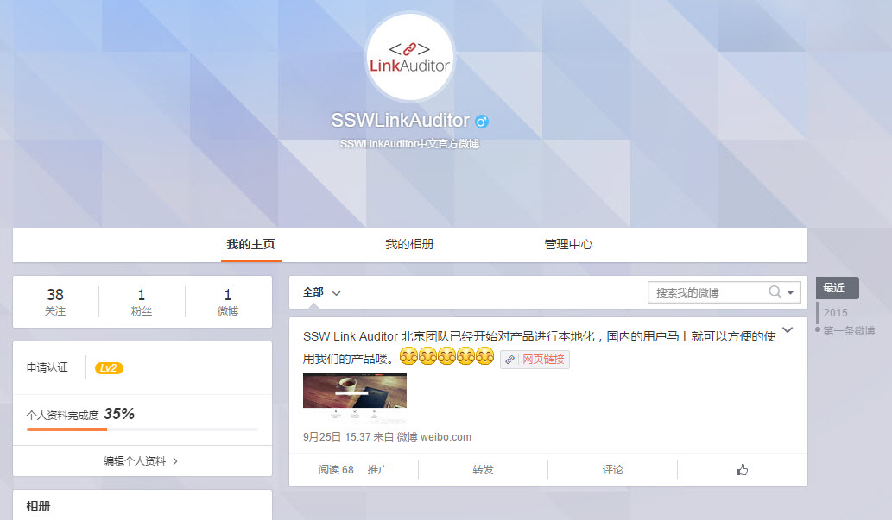

Promoting your application and business via social media can be extremely beneficial, not only for promoting a business but for feedback from customers as well. To help implement social media campaigns, try these tips:

<!--endintro-->

* Target platforms for the countries in which you’ll have either e-commerce or on-the-ground presence. e.g. Facebook/Qzone, Twitter/Weibo.
* Understand the specific social media websites and craft the message for each language. Always localize, don’t just translate. Google Translate just isn't good enough, always give it to a native speaker to translate.
* Don't make the text longer than what the shortest supported is (usually Twitter which is 140 characters).
* Studies show that posts with an image get more traction.
* Post it to the English site.
* Then post it to the Chinese site.
* Great, now you are ready to post to all of the social media platforms simultaneously.

  

::: greybox
We have a service called [SSW Chinafy](https://www.ssw.com.au/ssw/Consulting/Chinafy-App.aspx) that can help you get started following this rule.

:::
