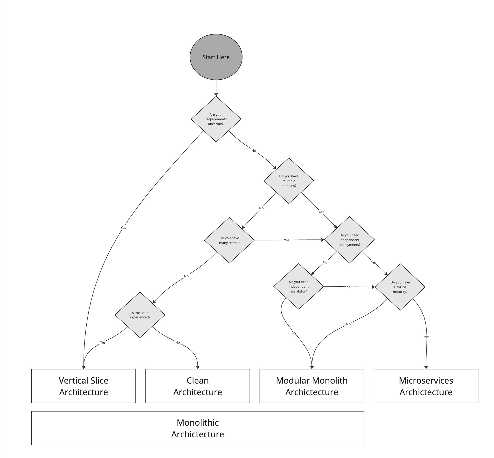

Choosing the right software architecture for your system is crucial for its success and maintainability. Making the wrong choice can lead to increased complexity, difficulty in scaling, and higher costs. Here are some of the popular architectures and factors to consider when deciding the best fit for your project.

<!--endintro-->

## Popular Architectures

### Clean Architecture

Clean Architecture emphasizes separation of concerns, making your system easier to maintain and scale. This architecture is designed to keep the business logic independent of the frameworks and tools, which helps in achieving a decoupled and testable codebase.

See more [here](/rules-to-better-clean-architecture/).

### Vertical Slice Architecture

Vertical Slice Architecture structures your system around features rather than technical layers. Each feature is implemented end-to-end, including UI/API, business logic, and data access. This approach improves maintainability and reduces the risk of breaking changes.

### Modular Monolith

A Modular Monolith organizes the system into modules that encapsulate specific functionalities. While it runs as a single application, it retains some benefits of microservices, such as independent module development and testing. It’s a good middle-ground between a monolith and microservices.

See more [here](/rules-to-better-modular-monoliths/).

### Microservices

Microservices architecture involves splitting the application into small, independently deployable services. Each service focuses on a specific business capability and can be developed, deployed, and scaled independently. This approach is beneficial for complex and large-scale applications with multiple teams working on different parts.

See more [here](/rules-to-better-microservices/).

## Factors to Consider

### Are your requirements certain?

If requirements are likely to change, Clean Architecture or Vertical Slice Architecture can offer more flexibility.

### Do you have multiple domains?

For applications with multiple domains, Modular Monoliths or Microservices can provide better separation and modularity.

### Do you have many teams?

If you have many teams, Microservices or Modular Monolith can help in reducing inter-team dependencies and allow parallel development.

### Do you need independent deployments?

If independent deployments are necessary, Microservices is the best choice due to its isolated nature.

### Do you need independent scalability?

Microservices allow each service to be scaled independently based on its specific needs, which can be more efficient and cost-effective.

### Do you have DevOps maturity?

Microservices require a mature DevOps culture to manage deployments, monitoring, and scaling effectively. Without this, the overhead can be overwhelming.

### Is the team experienced?

The complexity of Microservices can be challenging for less experienced teams. Vertical Slice Architecture although simple, has fewer guardrails when compared to Clean Architecture and can lead to a mess if not managed correctly.  This leads to recommending Clean Architecture for less experienced teams that need more structure.

## Architecture Decision Tree

## Examples

Here are some practical scenarios to illustrate the decision-making process:

::: greybox
**Scenario 1: Startup with Uncertain Requirements**

You are building an MVP with a small team and expect the requirements to evolve rapidly.

**Choice:** Clean Architecture or Vertical Slice Architecture.
:::
::: good
Figure: Good Example - These architectures offer flexibility and are easier to refactor as requirements change.
:::

::: greybox
**Scenario 2: Large Enterprise with Multiple Domains and Teams**

You are developing a large-scale application with multiple business domains and have several teams working in parallel.

**Choice:** Microservices.
:::
::: good
Figure: Good Example - Microservices allow independent development, deployment, and scaling, which suits large and complex applications.
:::

::: greybox
**Scenario 3: Medium-sized Business with Limited DevOps Maturity**

You have a mid-sized team, and your organization is still developing its DevOps practices.

**Choice:** Modular Monolith.
:::
::: good
Figure: Good Example - A Modular Monolith provides some modularity benefits without the full complexity of Microservices, making it easier to manage with limited DevOps capabilities.
:::

By carefully considering these factors and understanding the strengths and limitations of each architectural style, you can choose the best architecture for your system, ensuring a balance between flexibility, scalability, and maintainability.
