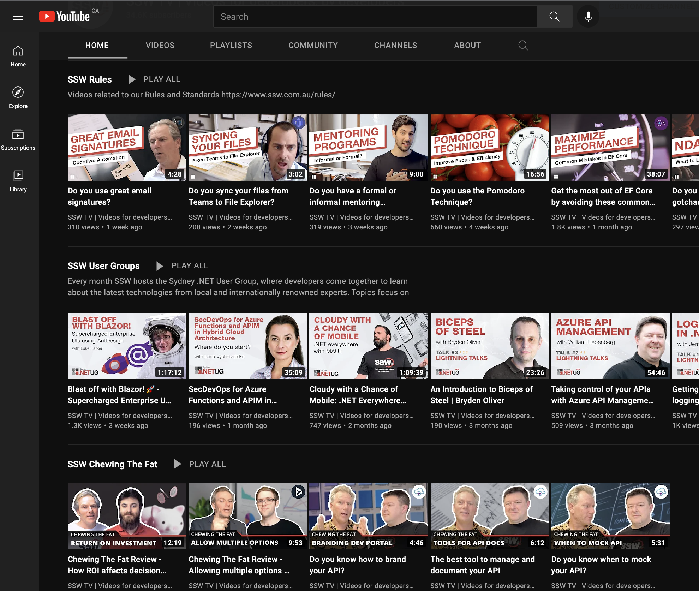
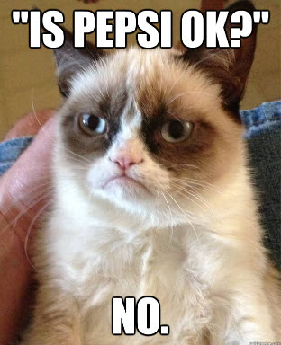
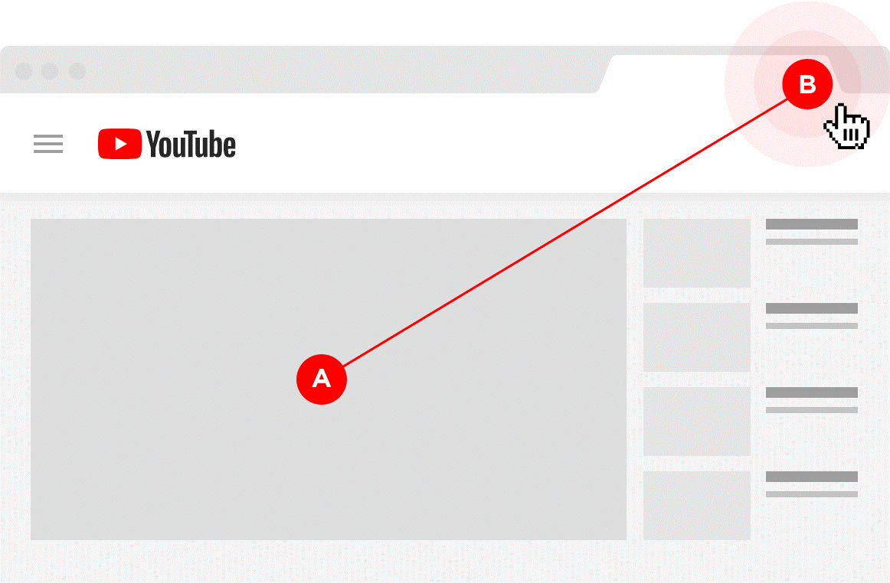
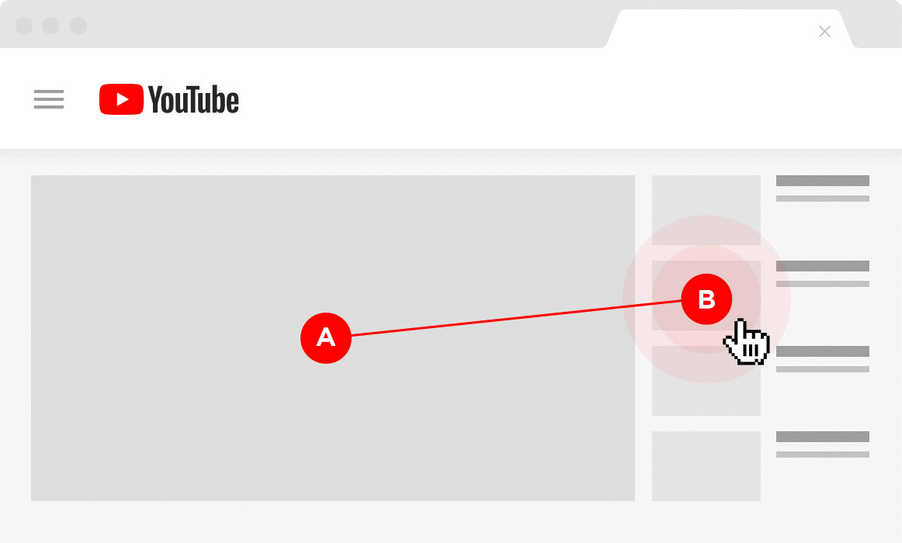

When uploading your videos to YouTube, your channel can look like a laundry basket of content if you don't keep it organised. A better way to manage your channel is to treat all of your videos like products, each with their own identifiable branding.  

The first step is to define your content, and then create a visual identifier by using [personalised video thumbnails](/video-thumbnails).

`youtube: https://www.youtube.com/embed/lh5WcImQzRY`

**Video: Do you have playlists & custom thumbnails on your YouTube channel? (3 min)**

::: good

:::

### Grouping similar content

Viewers are often looking for content similar to what they just watched, so creating and promoting optimized playlists is a plus as it increases session time (the amount of time spent by a person on YouTube after watching your video).

E.g. People who like Coca-Cola usually prefer more Coca-Cola:

YouTube wants people to spend more time on their website (to increase their revenue with ads), so if a channel makes people spend more time on YouTube, this channel gets a boost. YouTube will automatically launch another video from a playlist once the first video is over, increasing session time. This snowball effect will give your channel and videos a great boost!

::: bad

:::

::: ok

:::

::: good

:::

 **Images:** Courtesy of Brian Dean ([source](https://backlinko.com/grow-youtube-channel)).
