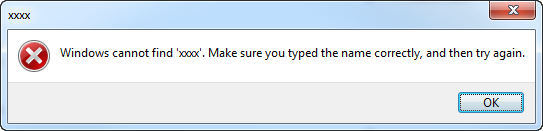

A message box automatically provides this functionality so there is no need to manually put a beep right before a message box pops up.

<!--endintro-->

::: good  
  
:::

```csharp
string message = "You did not enter a server name. Cancel this operation?";
string caption = "No Server Name Specified";
MessageBoxButtons buttons = MessageBoxButtons.YesNo;
System.Media.SystemSounds.Beep.Play();
DialogResult result = MessageBox.Show(this, message, caption, buttons);
```

::: bad
Figure: Bad example - The sound on the button is hardcoded in this code snippet
:::

```csharp
string message = "You did not enter a server name. Cancel this operation?";
string caption = "No Server Name Specified";
MessageBoxButtons buttons = MessageBoxButtons.YesNo;
DialogResult result = MessageBox.Show(this, message, caption, buttons);
```

::: good
Figure: Good example - The code is not present in this example as it is automatically done
:::
